# 📊 Resultados e Discussão – Simulações de Sinais Discretos

Este documento apresenta a **análise dos resultados obtidos** nas simulações computacionais, relacionando comportamento dos sinais, efeitos observados e aplicações práticas em engenharia.

---

# 🔧 1. Vibração em Máquinas Rotativas

## 📈 Resultados Obtidos

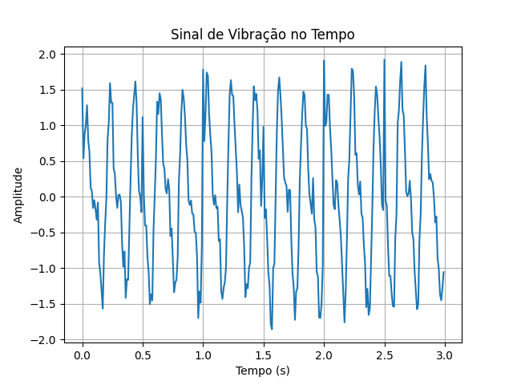
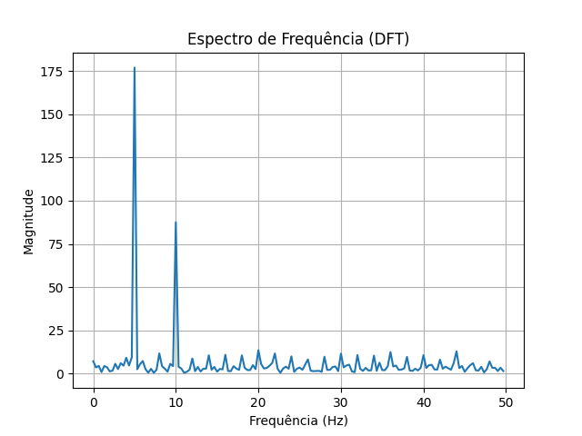

## 🧠 Análise

* O sinal no tempo apresenta:

  * comportamento periódico (frequência fundamental)
  * presença de ruído aleatório
  * picos associados a falhas mecânicas

* O espectro de frequência mostra:

  * pico dominante na frequência principal
  * presença de harmônicos
  * componentes adicionais devido a falhas

## 🔍 Interpretação Física

* Frequência fundamental → rotação do eixo
* Harmônicos → desalinhamento ou imperfeições
* Picos → possíveis falhas em rolamentos

---

# 🌡️ 2. Sensor Térmico Industrial

## 📈 Resultados Obtidos

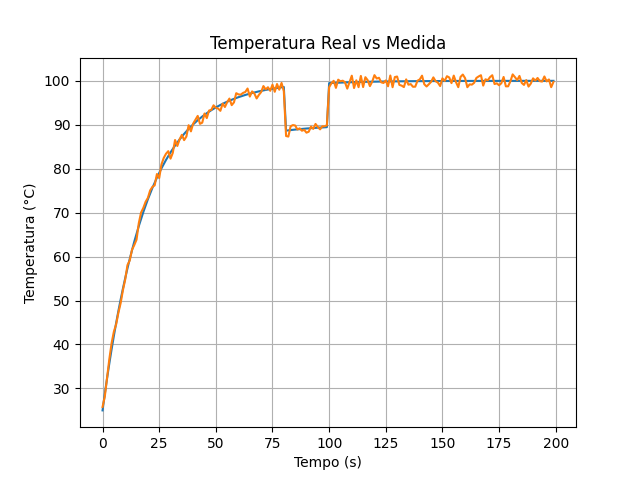
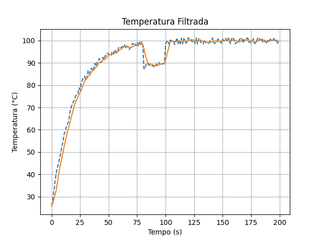
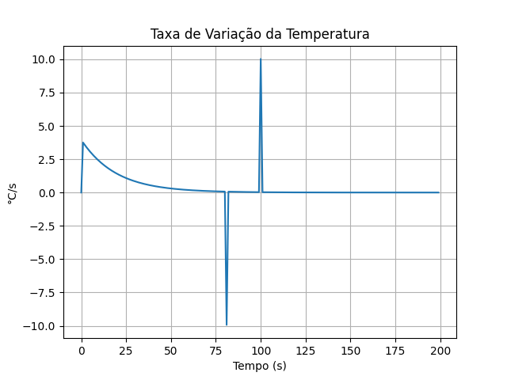

## 🧠 Análise

* A curva apresenta comportamento exponencial típico de sistemas térmicos
* O ruído afeta significativamente a medição
* O filtro reduz variações indesejadas
* A derivada mostra:

  * alta variação inicial
  * estabilização ao longo do tempo

## 🔍 Interpretação Física

* Crescimento exponencial → aquecimento natural
* Perturbações → eventos externos (ex: abertura de forno)
* Derivada → velocidade de aquecimento

---

# ⚡ 3. Sinais Elétricos Digitais

## 📈 Resultados Obtidos

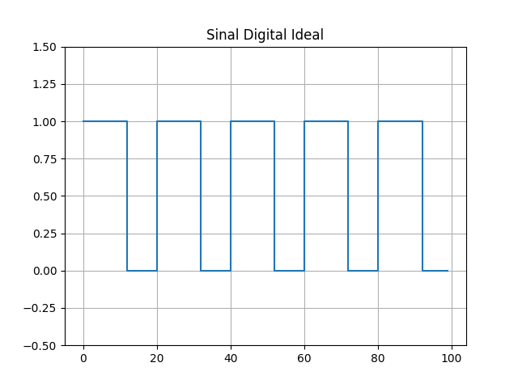
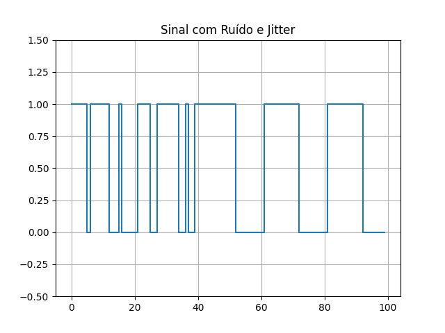
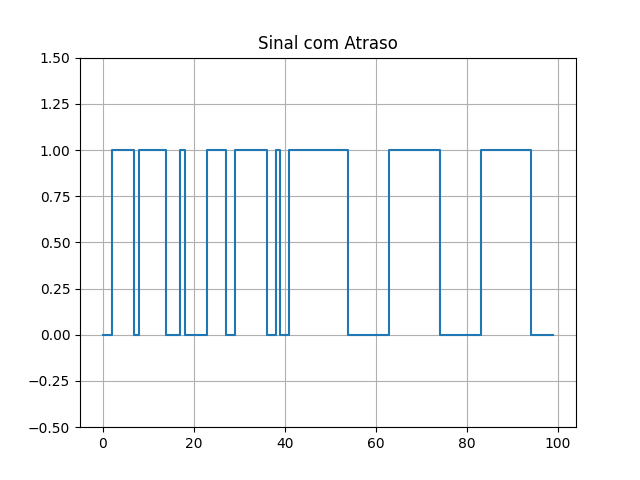

## 🧠 Análise

* O sinal ideal apresenta transições bem definidas
* O ruído causa inversões de bits (erros)
* O jitter desloca transições no tempo
* O atraso simula propagação em circuitos

## 🔍 Interpretação Física

* Bit flip → erro de transmissão
* Jitter → instabilidade de clock
* Atraso → tempo de propagação

---

# ⚙️ 4. Velocidade e Rotação de Eixos

## 📈 Resultados Obtidos

## 🧠 Análise

* O sinal de pulsos representa a leitura do encoder
* A velocidade real varia ao longo do tempo
* A velocidade estimada apresenta:

  * comportamento discreto
  * menor precisão em comparação ao valor real

## 🔍 Interpretação Física

* Pulsos → posição angular discreta
* Estimativa → cálculo indireto da velocidade
* Diferenças → limitações de sensores reais

---

# 🤖 5. Sistema Embarcado (Sensor com Filtragem)

## 📈 Resultados Obtidos

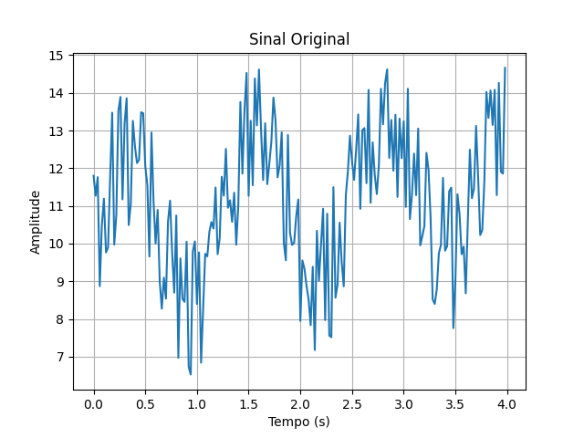
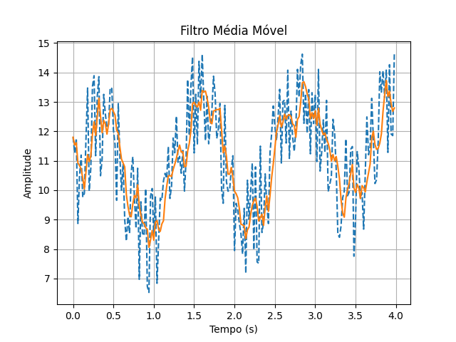
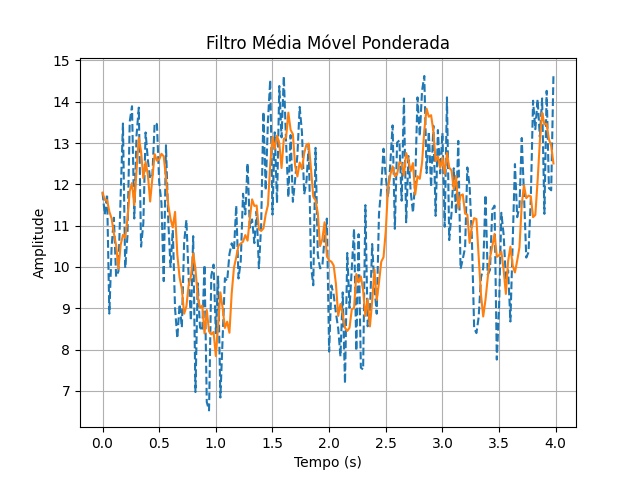

## 🧠 Análise

* O sinal original apresenta:

  * ruído elevado
  * variações lentas (drift)

* O filtro média móvel:

  * reduz ruído
  * suaviza o sinal
  * introduz atraso

* O filtro ponderado:

  * responde mais rápido
  * mantém suavização eficiente

## 🔍 Interpretação Física

* Ruído → interferência eletrônica
* Drift → variação do sensor ao longo do tempo
* Filtragem → essencial para sistemas embarcados

---

# 📊 Conclusão Geral

As simulações demonstram que:

* sinais reais são **afetados por ruído e imperfeições**
* modelos matemáticos permitem representar fenômenos físicos
* filtros são essenciais para melhorar qualidade do sinal
* sistemas digitais trabalham com **aproximações discretas**
* análise no tempo e frequência é fundamental

---

# 🚀 Conexão com Engenharia

Esses resultados são diretamente aplicáveis em:

* manutenção preditiva industrial
* automação e controle
* sistemas embarcados (ex: STM32)
* processamento digital de sinais (PDS)

---