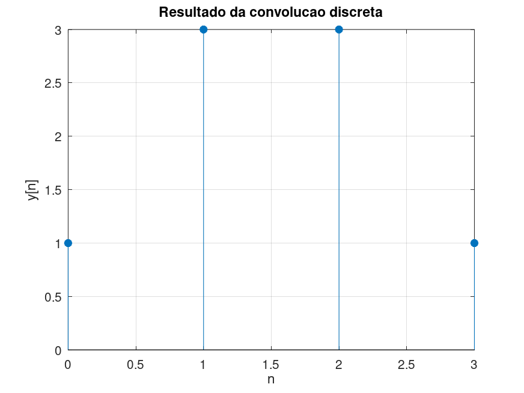
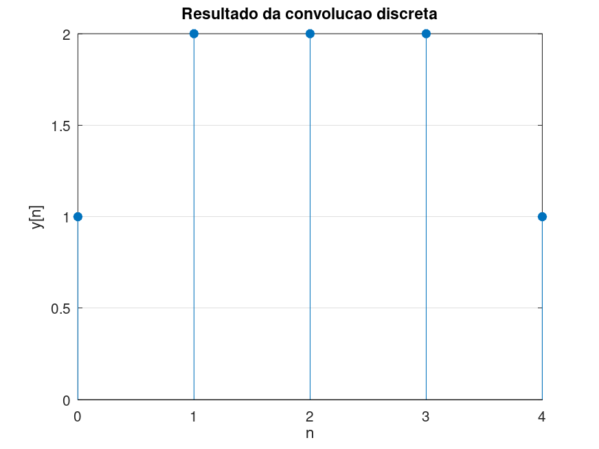

# Atividade 4 – Implementação Computacional

Código em MATLAB/Octave:

```matlab
clc;
clear;
close all;

x = [1 2 1];
h = [1 1];

y = conv(x, h);

disp('Sequencia x[n]:');
disp(x);

disp('Sequencia h[n]:');
disp(h);

disp('Convolucao y[n] = x[n] * h[n]:');
disp(y);

n = 0:length(y)-1;

stem(n, y, 'filled');
grid on;
xlabel('n');
ylabel('y[n]');
title('Resultado da convolucao discreta');
```

---

## 1) Execute o código e compare o resultado com o cálculo manual.

### Gráfico gerado:



---

### Cálculo manual

Tamanho:

Ny = Nx + Nh − 1  
Ny = 3 + 2 − 1 = 4

Valores:

y[0] = x[0]·h[0]  
y[0] = 1·1 = 1

y[1] = x[0]·h[1] + x[1]·h[0]  
y[1] = 1·1 + 2·1 = 3

y[2] = x[1]·h[1] + x[2]·h[0]  
y[2] = 2·1 + 1·1 = 3

y[3] = x[2]·h[1]  
y[3] = 1·1 = 1

---

### Resultado obtido:

```
y = [1 3 3 1]
```

O mesmo encontrado no cálculo manual e no código.

---

## 2) Explique a forma do sinal de saída obtido.

Cada ponto da saída é a soma de duas amostras consecutivas do sinal de entrada.
Isso gera o seguinte comportamento:

- Início (n = 0):
Há apenas uma sobreposição → valor pequeno
- Região central (n = 1 e 2):
Há duas sobreposições → valores maiores
- Final (n = 3):
Volta a ter apenas uma sobreposição → valor diminui

O resultado forma um perfil triangular que cresce, atinge um pico e decresce. Esse comportamento ocorre porque o sistema está somando valores vizinhos e “espalhando” a energia do sinal, isso caracteriza um efeito de suavização (filtro passa-baixa simples).

--- 

## 3) Modifique a entrada para x[n] = {1, 1, 1, 1} e interprete o novo resultado.

### Gráfico gerado:



---

### Cálculo manual:

Tamanho:

Ny = Nx + Nh − 1  
Ny = 4 + 2 − 1 = 5

Valores:

y[0] = x[0]·h[0]  
y[0] = 1·1 = 1

y[1] = x[0]·h[1] + x[1]·h[0]  
y[1] = 1·1 + 1·1 = 2

y[2] = x[1]·h[1] + x[2]·h[0]  
y[2] = 1·1 + 1·1 = 2

y[3] = x[2]·h[1] + x[3]·h[0]  
y[3] = 1·1 + 1·1 = 2

y[4] = x[3]·h[1]  
y[4] = 1·1 = 1

---

### Resultado:

```
y[n] = {1,2,2,2,1}
```

O mesmo encontrado no cálculo manual e no código, como todos os valores de x[n] são iguais a 1, a saída passa a refletir apenas a quantidade de sobreposições entre os sinais em cada deslocamento. 

- Nas extremidades há apenas 1 sobreposição → valor 1  
- No centro há 2 sobreposições → valor 2  

Isso gera um formato de "platô", mostrando que o sistema soma amostras vizinhas e produz valores constantes onde a sobreposição é máxima.