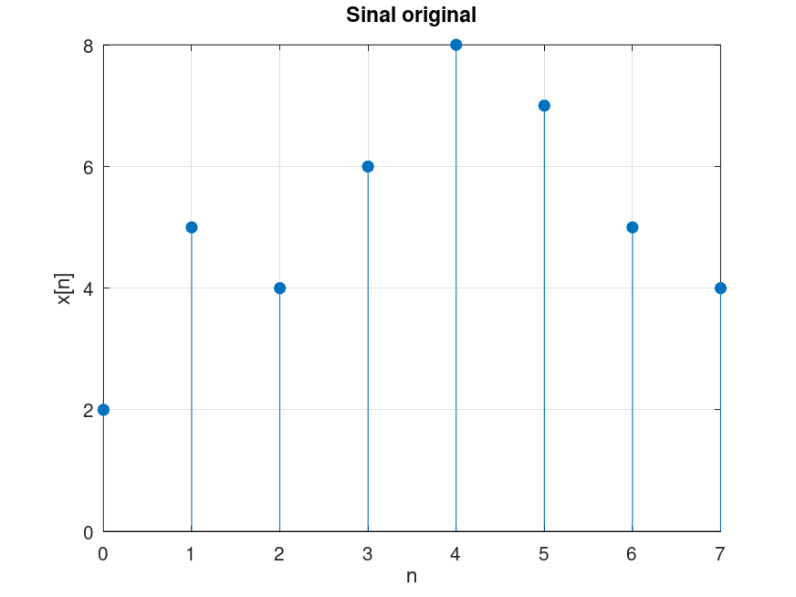
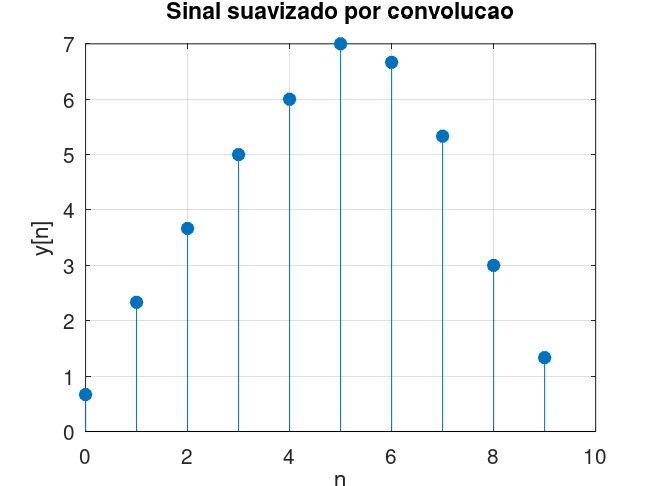

# Atividade 5 – Suavização de Sinais

Considere um sinal de sensor representado por:

```
x[n] = {2,5,4,6,8,7,5,4}
```

e um filtro de média simples:

```
h[n] = (1/3){1,1,1}
```
---
## Código sugerido (MATLAB/Octave):

```matlab
clc;
clear;
close all;

x = [2 5 4 6 8 7 5 4];
h = (1/3) * [1 1 1];

y = conv(x, h);

figure;
stem(0:length(x)-1, x, 'filled');
grid on;
xlabel('n');
ylabel('x[n]');
title('Sinal original');

figure;
stem(0:length(y)-1, y, 'filled');
grid on;
xlabel('n');
ylabel('y[n]');
title('Sinal suavizado por convolucao');
```
---

## 1) Realize a convolução entre x[n] e h[n].

```
y[n] = {0.67, 2.33, 3.67, 5.00, 6.00, 7.00, 6.67, 5.33, 3.00, 1.33}
```
---

## 2) Apresente o gráfico do sinal original e do sinal filtrado.





---

## 3) Explique por que esse filtro atua como suavizador

O filtro h[n] = (1/3){1,1,1} atua como suavizador porque realiza uma média entre três amostras consecutivas do sinal de entrada. Pela convolução, cada ponto da saída é dado por:

``` y[n] = (x[n] + x[n−1] + x[n−2]) / 3 ```

Isso significa que o valor em cada instante não depende apenas de um ponto isolado, mas da média local ao redor dele.

Como consequência:
- Variações bruscas (ruído ou picos) são reduzidas, pois são “diluídas” ao serem somadas com valores vizinhos  
- Regiões mais estáveis do sinal são preservadas  
- O sinal resultante fica mais “suave” e contínuo  

Em termos de frequência, variações rápidas correspondem a altas frequências. Como o filtro reduz essas variações, ele atenua componentes de alta frequência e mantém as de baixa frequência, caracterizando um filtro passa-baixa.

Portanto, ele suaviza o sinal porque faz uma média local, reduzindo ruído e transições abruptas.

---