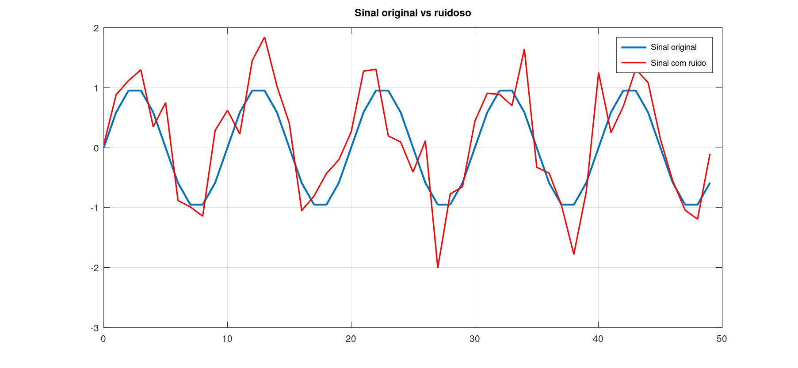
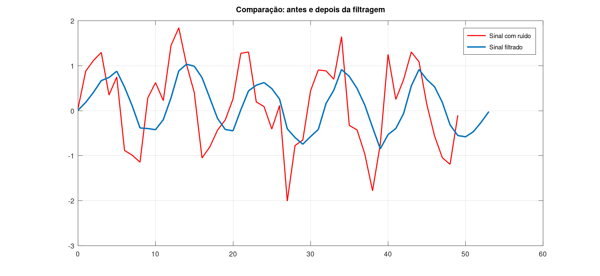

# 6. Desafio Proposto

Considere um sistema de aquisição de dados em que a leitura de um sensor apresenta **ruídos rápidos indesejados**. Explique como a convolução com um filtro de média móvel pode melhorar a qualidade do sinal medido.

---

## Resposta:

Com o **filtro de média móvel**, a resposta ao impulso é:

```
h[n] = (1/N){1,1,1,...}
```

A convolução entre o sinal e esse filtro calcula a média de várias amostras consecutivas.

- O ruído varia rapidamente → valores sobem e descem rapidamente  
- A média "equilibra" essas variações → reduz oscilações  
- O sinal útil geralmente varia lentamente → é preservado  

Resultado: um sinal mais suave e estável.

---

## Por que ocorre suavização?

Ruídos são caracterizados por **altas frequências** (mudanças rápidas no tempo).

Ao fazer a média:

- valores altos e baixos tendem a se cancelar  
- picos são reduzidos  
- vales são elevados  

Isso reduz a amplitude das variações rápidas.

Em termos de frequência:

- o filtro **atenua altas frequências (ruído)**  
- preserva **baixas frequências (informação útil)**  

Por isso ele é um **filtro passa-baixa**.


---

## Qual é o papel da resposta ao impulso do filtro

A resposta ao impulso define:

- quantas amostras serão usadas na média
- o nível de suavização

Imagine nesses casos:

- **N pequeno (ex: 3):**
  - pouca suavização  
  - resposta rápida  
  - mantém mais detalhes  

- **N grande (ex: 10 ou mais):**
  - maior suavização  
  - reduz mais o ruído  
  - pode distorcer o sinal  

 N controla o **compromisso entre suavização e fidelidade**.

---

## Quais são as possíveis limitações desse procedimento?

Apesar de simples, o filtro de média móvel possui algumas desvantagens:

- Atraso no sinal: A saída depende de amostras passadas, ou seja, o sistema introduz um atraso (delay).

- Perda de detalhes: Mudanças rápidas (bordas, picos reais) também são suavizadas.

- Resposta lenta: O sistema demora a reagir a mudanças abruptas no sinal.

Mesmo com limitações, é amplamente utilizado em:

- sensores industriais  
- sistemas embarcados (ex: microcontroladores STM32)  
- aquisição de dados  
- pré-processamento de sinais  

---

## Exemplo em MATLAB/Octave

```matlab
clc;
clear;
close all;

% Sinal original (simulando sensor)
n = 0:49;
x = sin(0.2*pi*n);

% Adicionando ruído
ruido = 0.5 * randn(size(n));
x_ruidoso = x + ruido;

% Filtro de média móvel
N = 5;
h = (1/N) * ones(1, N);

% Convolução
y = conv(x_ruidoso, h);

% Ajuste de eixo para saída
ny = 0:length(y)-1;

% Plot sinal original + ruidoso
figure;
plot(n, x, 'LineWidth', 2); hold on;
plot(n, x_ruidoso, 'r', 'LineWidth', 1.5);
grid on;
legend('Sinal original', 'Sinal com ruído');
title('Sinal original vs ruidoso');

% Comparação sinal filtrado + ruidoso
figure;
plot(n, x_ruidoso, 'r', 'LineWidth', 1.5); hold on;
plot(ny, y, 'LineWidth', 2);
grid on;
legend('Sinal com ruído', 'Sinal filtrado');
title('Comparação: antes e depois da filtragem');
```
---

## Gráficos gerados





---

## Conclusão

A aplicação do filtro de média móvel mostrou-se eficaz na redução dos ruídos presentes no sinal do sensor. Observa-se que o sinal filtrado apresenta uma variação mais suave em comparação ao sinal ruidoso, evidenciando a atenuação de oscilações rápidas indesejadas.

Esse comportamento ocorre porque o filtro realiza uma média entre amostras consecutivas, reduzindo componentes de alta frequência (ruído) e preservando as variações mais lentas do sinal original. Como resultado, obtém-se um sinal mais estável e adequado para análise ou processamento posterior.

Entretanto, também foi possível perceber que essa suavização introduz um certo atraso e pode reduzir detalhes mais abruptos do sinal. Assim, há um compromisso entre redução de ruído e preservação da informação, sendo importante escolher adequadamente o tamanho da janela do filtro.

De forma geral, o filtro de média móvel é uma solução simples, eficiente e amplamente utilizada para melhorar a qualidade de sinais em sistemas de aquisição de dados.