## 📊 Resultados

### Questão 1 — Sinal no Domínio do Tempo e Espectro
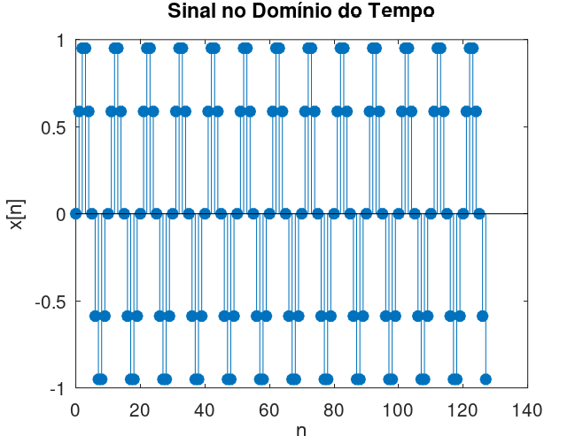
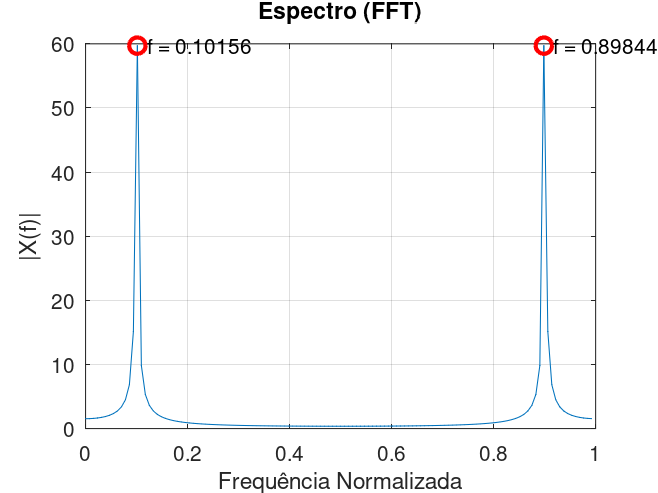

**Observações:**
- O sinal no domínio do tempo é composto pela soma de duas senóides com frequências normalizadas distintas.
- No espectro de magnitude (FFT), observam-se dois picos principais correspondentes às frequências utilizadas na geração do sinal.
- Como as frequências escolhidas coincidem com bins da FFT, o espectro apresenta picos bem definidos e pouco vazamento espectral.

---

### Questão 2 — Soma de Duas Senoides e Análise no Domínio da Frequência

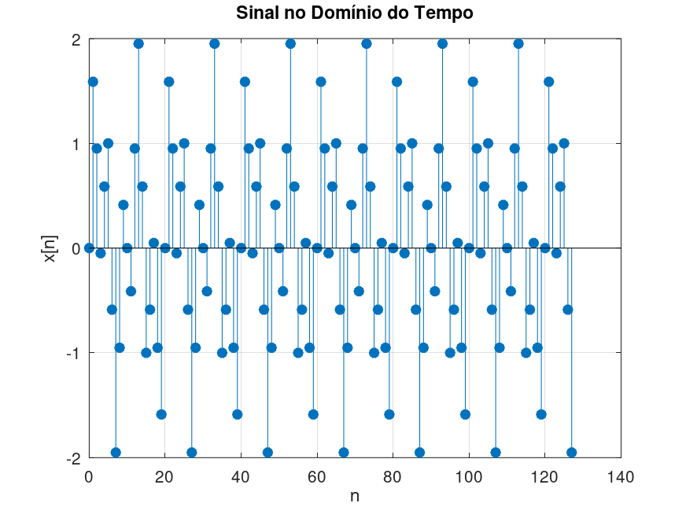

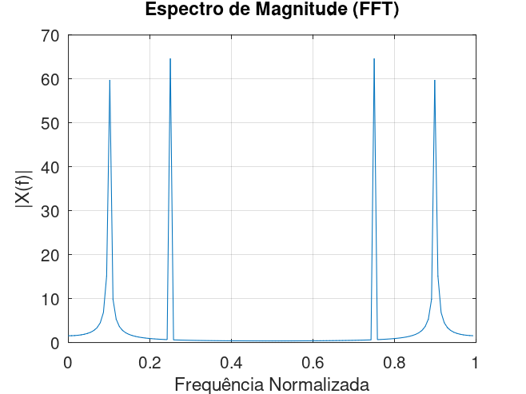

Nesta questão, foram geradas duas senoides com frequências normalizadas distintas:

- $f_1 = 0.10$
- $f_2 = 0.25$

Cada senoide foi definida por:

- $x_1[n] = sen(2\pi \cdot  f_1 \cdot n)$
- $x_2[n] = sen(2\pi \cdot  f_2 \cdot n)$

O sinal final analisado foi obtido pela soma:

- $x[n] = x_1[n] + x_2[n]$

#### Análise no domínio do tempo

No domínio do tempo, o sinal resultante apresenta uma forma de onda mais complexa, pois representa a superposição de duas oscilações com frequências diferentes.

Embora seja possível perceber que o sinal possui um comportamento periódico, não é simples identificar visualmente quais frequências compõem o sinal apenas observando sua forma temporal.

#### Análise no domínio da frequência

Ao aplicar a FFT (Fast Fourier Transform) ao sinal resultante, o espectro de magnitude apresentou dois picos bem definidos:

- Um pico em $f = 0.10$
- Um pico em $f = 0.25$

Esses picos correspondem exatamente às frequências das duas senoides geradas.

#### Interpretação dos resultados

O resultado confirma que a Transformada de Fourier é capaz de decompor um sinal complexo em suas componentes senoidais fundamentais.

No domínio do tempo:
- Observa-se apenas a forma de onda resultante da soma.

No domínio da frequência:
- Observam-se separadamente as frequências presentes no sinal.

#### Relação entre os domínios do tempo e da frequência

Os domínios do tempo e da frequência são duas representações equivalentes do mesmo sinal.

- **Domínio do tempo:** mostra como a amplitude varia ao longo das amostras.
- **Domínio da frequência:** mostra quais frequências compõem o sinal e a intensidade de cada uma.

Um sinal aparentemente complexo no tempo pode ser descrito de forma simples no domínio da frequência.

#### Conclusão

A FFT permitiu identificar claramente as duas componentes senoidais presentes no sinal somado, demonstrando que a análise no domínio da frequência é uma ferramenta poderosa para detectar e separar frequências individuais que não são facilmente perceptíveis no domínio do tempo.

---

### Questão 3 — Demonstração do Fenômeno de Aliasing
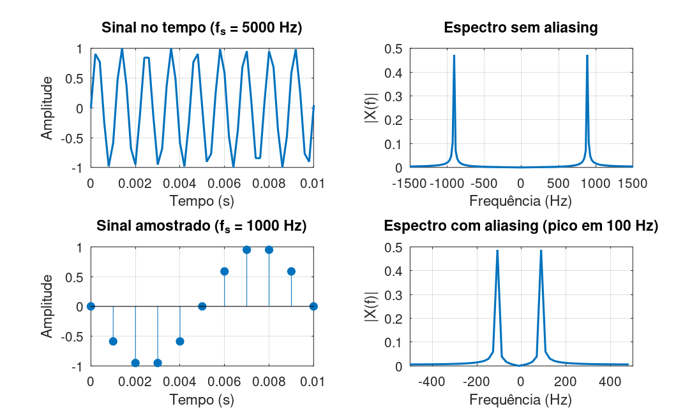

**Descrição do experimento:**
Foi gerado um sinal senoidal com frequência de 900 Hz e analisado em duas situações:
1. Taxa de amostragem adequada: 5000 Hz.
2. Taxa de amostragem reduzida: 1000 Hz.

**Comparação dos espectros:**
- Com $f_s$ = 5000 Hz, os picos do espectro aparecem corretamente em ±900 Hz.
- Com $f_s$ = 1000 Hz, a condição de Nyquist é violada, e o sinal passa a aparecer em ±100 Hz.

**Explicação do aliasing:**
Quando a taxa de amostragem é menor que o dobro da maior frequência do sinal, ocorre sobreposição das réplicas espectrais, fazendo com que uma frequência alta seja interpretada como outra mais baixa.

A frequência observada é dada por:

$$f_{alias} = |f_0 - k \cdot f_s|$$

No exemplo:

$$f_{alias} = |900 - 1000| = 100 Hz$$

**Conclusão:**
O sinal de 900 Hz é erroneamente interpretado como um sinal de 100 Hz devido à subamostragem.

---

### Questão 4 — Efeito do Janelamento e Vazamento Espectral
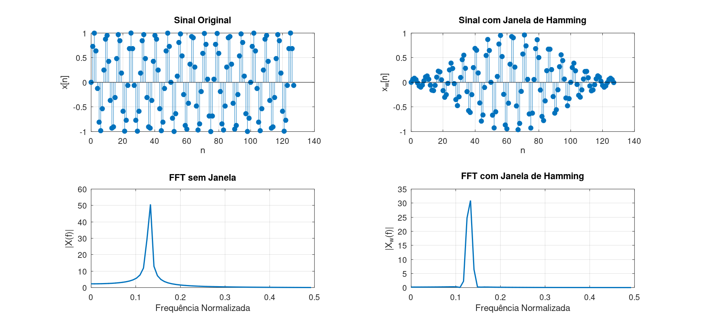

**Descrição do experimento:**
Foi gerado um sinal senoidal com frequência normalizada $f_s = 0.13$, que não coincide exatamente com um bin da FFT, provocando vazamento espectral.

**Resultados observados:**

#### Sem janela
- O espectro apresenta lóbulos laterais elevados.
- A energia da senóide espalha-se por diversas frequências adjacentes.
- O pico principal é menos destacado.

#### Com janela de Hamming
- Os lóbulos laterais são significativamente reduzidos.
- O espectro torna-se mais limpo.
- O pico principal fica mais largo.

**Discussão:**
O janelamento suaviza as extremidades do sinal no tempo, reduzindo as descontinuidades e, consequentemente, o vazamento espectral.

**Vantagem:**
- Redução do espalhamento de energia em frequências vizinhas.

**Desvantagem:**
- Perda de resolução em frequência devido ao alargamento do lóbulo principal.

**Conclusão:**
A janela de Hamming fornece um espectro mais representativo das componentes reais do sinal, reduzindo significativamente o vazamento espectral.

---

### Questão 5 — Senoide com Ruído Aditivo e Análise Espectral

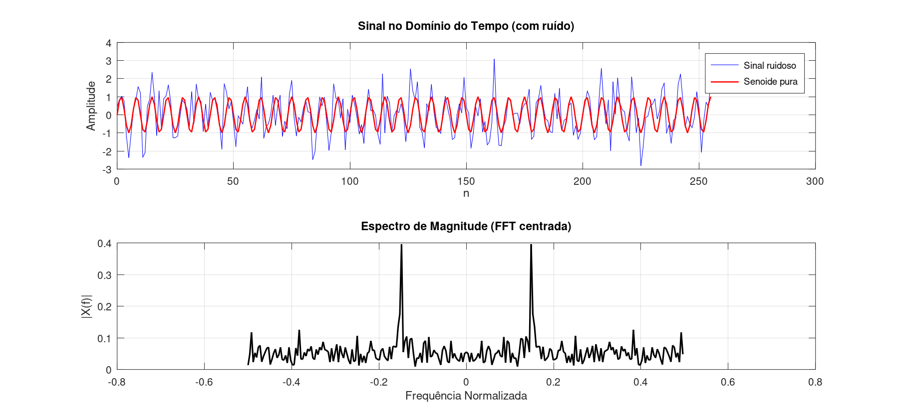

Nesta questão, foi gerado um sinal composto por uma senoide de frequência definida e ruído aditivo branco (gaussiano). O objetivo foi analisar como o ruído afeta a identificação da frequência principal no domínio da frequência.

#### Construção do sinal

O sinal foi definido como:

$$
x[n] = s[n] + w[n]
$$

onde:
- A senoide representa a componente útil do sinal.
- O ruído representa perturbações aleatórias distribuídas ao longo de todas as frequências.

#### Análise no domínio do tempo

No domínio do tempo, o sinal apresenta uma forma altamente irregular devido à presença do ruído.

- A senoide ainda está presente, mas fica mascarada.
- O comportamento periódico não é facilmente perceptível visualmente.

Isso dificulta a identificação direta da frequência dominante apenas observando o sinal temporal.

#### Análise no domínio da frequência (FFT)

Ao aplicar a FFT, observa-se:

- Um pico principal na frequência correspondente à senoide ($f_0$).
- Um espectro de fundo espalhado devido ao ruído.

O ruído branco possui energia distribuída em todas as frequências, o que gera um "chão espectral" elevado.

#### Dificuldade de identificação da frequência

A principal dificuldade está no fato de que:

- O ruído pode esconder parcialmente o pico da senoide.
- Quanto maior o nível de ruído, menos evidente é o pico espectral.

Em casos extremos, o pico da frequência útil pode ser quase indistinguível.

#### Importância da análise espectral

A FFT permite separar o sinal em componentes de frequência, tornando possível:

- Identificar a frequência dominante (sinal útil).
- Visualizar a distribuição do ruído.
- Aplicar filtros passa-faixa para recuperação do sinal original.

#### Conclusão

Apesar do ruído dificultar a análise no domínio do tempo, o domínio da frequência permite identificar a componente principal do sinal. A análise espectral é essencial em sistemas de comunicação, processamento de sinais e filtragem, pois possibilita a separação entre informação útil e perturbações.

---

### Questão 6 — Implementação da DFT e Comparação com FFT

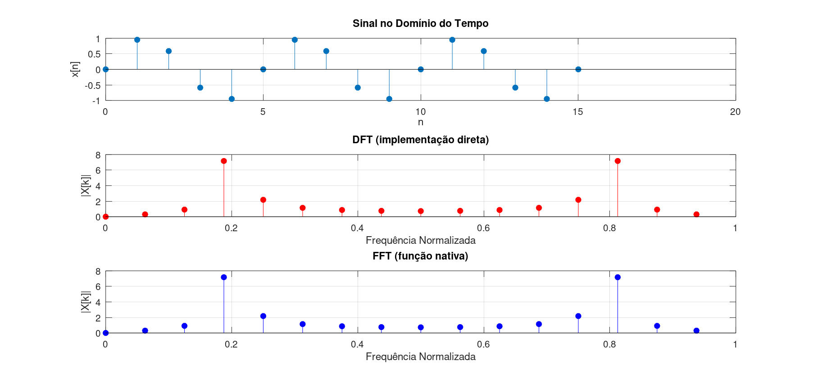

Nesta questão, a Transformada Discreta de Fourier (DFT) foi implementada manualmente utilizando sua definição matemática, e seus resultados foram comparados com a função FFT nativa.

#### Implementação da DFT

A DFT foi calculada diretamente pela fórmula:

$$X[k] = \sum_{n=0}^{N-1} x[n] \cdot e^{-j\left(\frac{2\pi}{N}\right)kn}$$

A implementação utilizou dois laços `for`:

- Um para o índice de frequência $k$
- Outro para o índice temporal $n$

Isso resulta em uma complexidade computacional elevada.

#### Resultados obtidos

Ao comparar os espectros:

- A DFT manual e a FFT produzem resultados praticamente idênticos.
- Os picos de frequência aparecem nas mesmas posições.
- As amplitudes são equivalentes (diferenças apenas numéricas mínimas por precisão de ponto flutuante).

Isso confirma que:

- A FFT é apenas uma forma otimizada de calcular a DFT.

#### Equivalência entre DFT e FFT

A FFT não é uma transformada diferente, mas sim um algoritmo eficiente para calcular a DFT.

Portanto:

- DFT (manual) = definição matemática direta
- FFT = mesma operação, porém otimizada

#### Custo computacional

A principal diferença entre as duas abordagens está na complexidade:

- DFT direta:  
  - Complexidade: **O(N²)**
  - Muito lenta para grandes valores de N

- FFT:
  - Complexidade: **O(N log N)**
  - Muito mais eficiente

#### Interpretação prática

Para sinais pequenos, como $N = 16$, ambas as abordagens são viáveis e apresentam resultados idênticos.

No entanto, para sinais reais (milhares ou milhões de amostras), a DFT direta torna-se impraticável, enquanto a FFT é amplamente utilizada em sistemas reais de processamento digital de sinais.

#### Conclusão

A comparação confirma a equivalência matemática entre DFT e FFT, mostrando que a FFT é uma implementação otimizada da mesma transformada. A principal vantagem da FFT é a drástica redução do custo computacional, tornando possível o processamento eficiente de sinais em aplicações reais.

---

### Questão 7 — Resposta ao Impulso e Estabilidade de Sistema Discreto

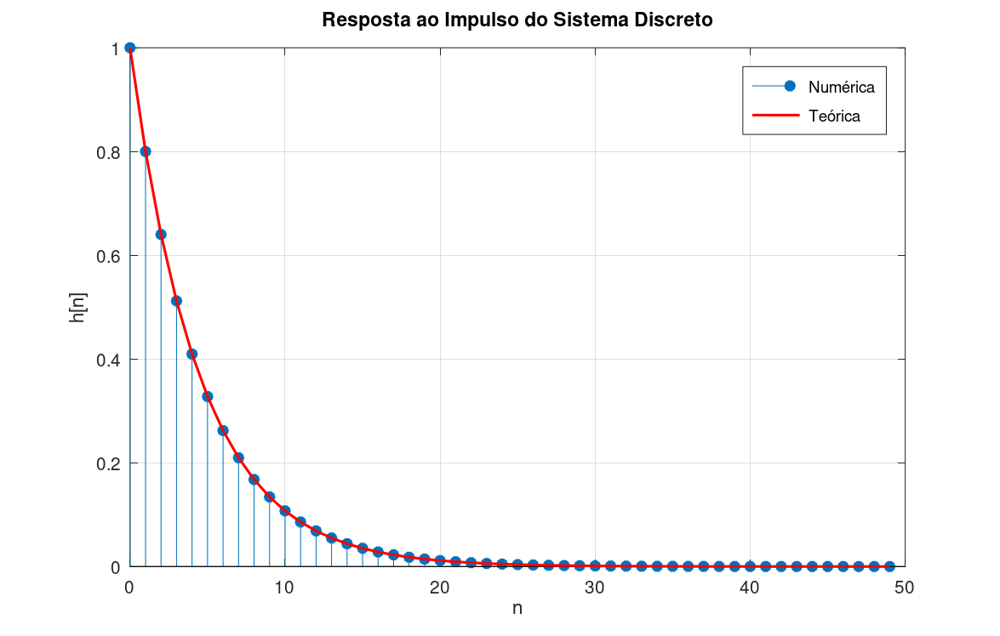

Foi analisado o sistema discreto definido pela função de transferência:

$$H(z) = \frac{1}{1 - 0.8 \cdot z^{-1}}$$

#### Determinação da resposta ao impulso

Para encontrar a resposta ao impulso, considera-se a entrada:

- $x[n] = δ[n]$

Aplicando a equação recursiva do sistema:

- $y[n] = 0.8 \cdot y[n−1] + x[n]$

A sequência resultante pode ser calculada numericamente.

#### Forma da resposta ao impulso

A resposta obtida segue a forma:

$$h[n] = (0.8)^n \cdot u[n]$$

Isso significa que:

- O sistema gera uma sequência exponencial decrescente.
- A energia do sinal diminui ao longo do tempo.

#### Análise do comportamento da sequência

Observa-se que:

- Os valores começam em 1.
- Decaem exponencialmente com fator 0.8.
- Tendem a zero conforme n aumenta.

Isso indica que o sistema não apresenta crescimento ilimitado.

#### Estabilidade do sistema

Um sistema discreto é estável (BIBO estável) quando sua resposta ao impulso é absolutamente somável:

$$
\sum_{n=0}^{\infty} |h[n]| < \infty
$$

No caso:

- `|0.8| < 1`

Logo, a sequência decai exponencialmente e a soma converge.

#### Conclusão

O sistema é **estável**, pois:

- O polo está dentro do círculo unitário (`|0.8| < 1`)
- A resposta ao impulso decai para zero
- A energia total é finita

Portanto, o sistema é BIBO estável.

---

### Questão 8 — Resolução espectral e número de amostras

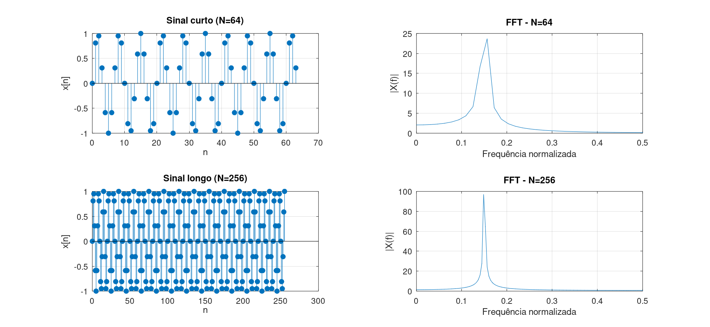

Nesta questão, foram analisados dois sinais senoidais com a mesma frequência fundamental (f0  = 0.15), porém com durações diferentes:

- Sinal curto: `N = 64`
- Sinal longo: `N = 256`

#### Comparação no domínio do tempo

No domínio do tempo:

- Ambos os sinais possuem a mesma frequência.
- O sinal com maior número de amostras representa mais ciclos da senoide.
- O sinal curto contém menos informação temporal.

#### Comparação no domínio da frequência

Após aplicar a FFT:

- Ambos os sinais apresentam um pico na mesma frequência (f0  = 0.15).
- No entanto, a diferença está na **nitidez do pico espectral**.

Resultados observados:

- N = 64:
  - Pico mais “alargado”
  - Menor precisão na localização da frequência
  - Maior vazamento espectral relativo

- N = 256:
  - Pico mais estreito e definido
  - Melhor separação entre frequências próximas
  - Menor incerteza na estimativa de frequência

#### Influência do número de amostras

O número de amostras está diretamente ligado à resolução em frequência:

$$\Delta f = \frac{1}{N}$$

Assim:

- Quanto maior N → menor Δf → maior resolução espectral
- Quanto menor N → maior Δf → pior resolução espectral

#### Interpretação física

A FFT “enxerga” o sinal como um conjunto de bins de frequência:

- Mais amostras → mais bins disponíveis → espectro mais detalhado
- Menos amostras → menos bins → espectro mais grosseiro

#### Conclusão

O aumento do número de amostras não altera a frequência fundamental do sinal, mas melhora significativamente a capacidade de distingui-la no domínio da frequência.

Portanto:

- Sinais longos → melhor resolução espectral
- Sinais curtos → pior resolução espectral e maior incerteza na análise

---

### Questão 9 — Frequência fundamental e harmônica

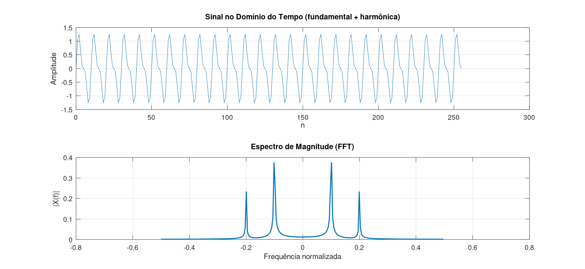

Nesta questão, foi gerado um sinal composto por:

- Uma frequência fundamental ($f_0 = 0.10$)
- Uma componente harmônica (2ª harmônica, $2f_0$)

O sinal resultante é:

- $x[n] = x_1[n] + x_2[n]$

#### Análise no domínio do tempo

No domínio do tempo:

- O sinal apresenta uma forma periódica, porém não senoidal pura.
- A presença da harmônica distorce a forma da onda original.
- Essa distorção é sutil e difícil de identificar apenas visualmente.

#### Análise no domínio da frequência

Após aplicar a FFT, o espectro apresenta:

- Um pico em $f = 0.10$ (frequência fundamental)
- Um segundo pico em $f = 0.20$ (2ª harmônica)

Isso confirma que o sinal contém múltiplas componentes senoidais.

#### Interpretação física das harmônicas

Harmônicas são múltiplos inteiros da frequência fundamental:

- 1ª harmônica → $f_0$
- 2ª harmônica → $2f_0$
- 3ª harmônica → $3f_0$
- etc.

Elas surgem devido a:

- não linearidades no sistema
- deformações periódicas
- vibrações mecânicas complexas

#### Aplicação em vibrações mecânicas

A análise espectral é amplamente usada em engenharia para diagnóstico de falhas:

- Desbalanceamento em máquinas rotativas → aumento da fundamental
- Falhas em rolamentos → surgimento de harmônicas específicas
- Engrenagens defeituosas → padrões harmônicos repetitivos

#### Vantagem da FFT nesse contexto

A FFT permite:

- Identificar frequências ocultas no sinal
- Separar componentes periódicas
- Detectar padrões de falha antes de colapso mecânico

#### Conclusão

A análise no domínio da frequência revela claramente a presença da frequência fundamental e sua harmônica, algo que não é facilmente visível no domínio do tempo.

Esse tipo de análise é essencial em manutenção preditiva e diagnóstico de sistemas mecânicos.

### Questão 10 — Análise espectral de um sinal real

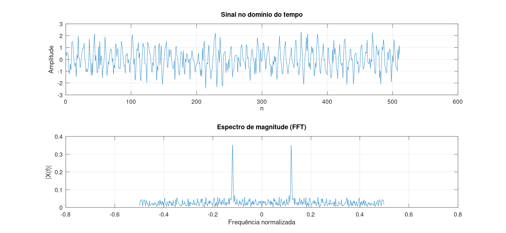

Nesta questão foi realizada a análise espectral de um sinal sintético com ruído, simulando um caso típico de áudio ou vibração mecânica.

#### Sinal analisado

O sinal foi construído como a soma de uma componente senoidal e ruído aditivo:

$$
x[n] = s[n] + w[n]
$$

onde:
- $s[n]$ representa a componente senoidal (sinal útil)
- $w[n]$ representa ruído branco aditivo (perturbação)

#### Análise no domínio do tempo

No domínio do tempo, observa-se que:

- O sinal apresenta comportamento irregular devido ao ruído
- A estrutura periódica da senoide não é facilmente identificável
- O ruído mascara parcialmente a informação útil

#### Análise no domínio da frequência (FFT)

Após aplicação da Transformada Rápida de Fourier (FFT), observa-se:

- Um pico bem definido na frequência da senoide $f_0$
- Um espectro de fundo distribuído ao longo de várias frequências
- Energia do ruído espalhada por todo o espectro

O ruído branco apresenta característica de distribuição aproximadamente uniforme no domínio da frequência.

#### Interpretação física

A análise espectral permite separar o sinal em duas componentes principais:

- ✔ **Componente útil:** pico estreito associado à frequência fundamental
- ✖ **Ruído:** energia distribuída em múltiplas frequências

Isso evidencia a capacidade da FFT de revelar estruturas ocultas no sinal original.

#### Aplicações em engenharia

Esse tipo de análise é amplamente utilizado em:

- Vibrações mecânicas (máquinas rotativas)
- Diagnóstico de falhas em rolamentos
- Análise de áudio e processamento de sinais
- Manutenção preditiva industrial

Exemplos típicos:

- Desbalanceamento → pico na frequência fundamental
- Defeitos em engrenagens → harmônicas adicionais
- Falhas em rolamentos → componentes espectrais característicos

#### Conclusão

A análise mostra que:

- No domínio do tempo, o ruído dificulta a interpretação do sinal
- No domínio da frequência, a componente principal se torna claramente visível

Assim, a FFT é uma ferramenta essencial para separação entre informação útil e perturbações em sinais reais.