# Questão 01

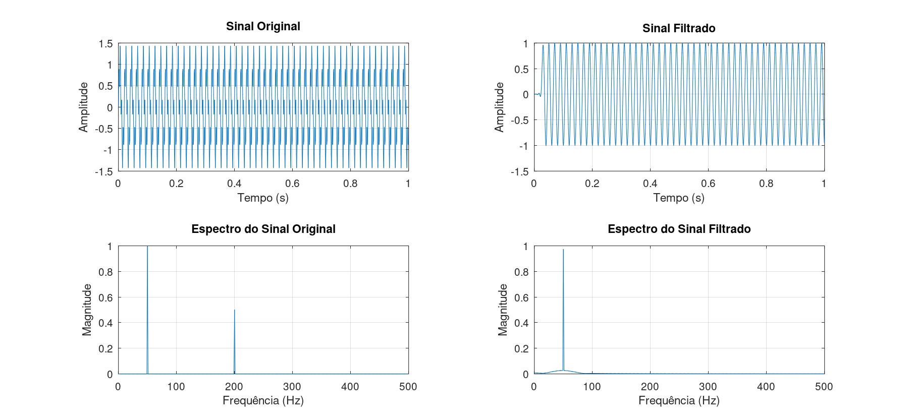

Nesta atividade foi gerado um sinal composto pela soma de duas senoides com frequências distintas:

- 50 Hz;
- 200 Hz.

O objetivo foi projetar um filtro passa-baixa capaz de preservar a componente de baixa frequência e atenuar a componente de alta frequência presente no sinal.

## Projeto do Filtro

Foi utilizado um filtro FIR passa-baixa com:

- frequência de corte: 100 Hz;
- ordem: 60.

Como a frequência de 50 Hz está abaixo da frequência de corte, espera-se que ela atravesse o filtro com pouca atenuação.

Por outro lado, a frequência de 200 Hz encontra-se acima da frequência de corte e, portanto, deve ser significativamente reduzida.

## Análise no Domínio do Tempo

Antes da filtragem, o sinal apresenta uma forma de onda resultante da combinação das duas senoides.

A presença da componente de 200 Hz produz oscilações rápidas sobre a forma de onda principal.

Após a aplicação do filtro passa-baixa, observa-se uma forma de onda mais suave, indicando a remoção da componente de alta frequência.

O sinal resultante aproxima-se de uma senoide de 50 Hz.

## Análise no Domínio da Frequência

A FFT do sinal original apresenta dois picos principais:

- pico em 50 Hz;
- pico em 200 Hz.

Após a filtragem:

- o pico em 50 Hz permanece praticamente inalterado;
- o pico em 200 Hz é fortemente atenuado;
- a maior parte da energia do sinal concentra-se na região de baixas frequências.

Esses resultados confirmam que o filtro passa-baixa realizou corretamente a separação espectral das componentes do sinal.

## Interpretação Física

O filtro passa-baixa permite a passagem das frequências inferiores à frequência de corte e reduz a amplitude das frequências superiores.

Fisicamente, ele atua como um seletor de componentes lentas do sinal.

Neste experimento:

- a senoide de 50 Hz representa a informação desejada;
- a senoide de 200 Hz representa uma interferência ou componente indesejada.

Após a filtragem, apenas a informação de baixa frequência permanece com amplitude significativa.

## Aplicações Práticas

Filtros passa-baixa são amplamente utilizados em:

- remoção de ruído de alta frequência;
- processamento de áudio;
- aquisição de sinais de sensores;
- sistemas biomédicos;
- telecomunicações;
- instrumentação eletrônica.

Por exemplo, em sensores de temperatura, um filtro passa-baixa pode eliminar ruídos elétricos rápidos e preservar apenas a variação real da grandeza medida.

## Conclusão

Os resultados demonstram que o filtro passa-baixa foi capaz de preservar a componente de 50 Hz e atenuar significativamente a componente de 200 Hz presente no sinal composto.

A análise espectral confirmou a remoção da frequência acima da banda de passagem, evidenciando o funcionamento e a eficiência do processo de filtragem digital.

# Questão 02

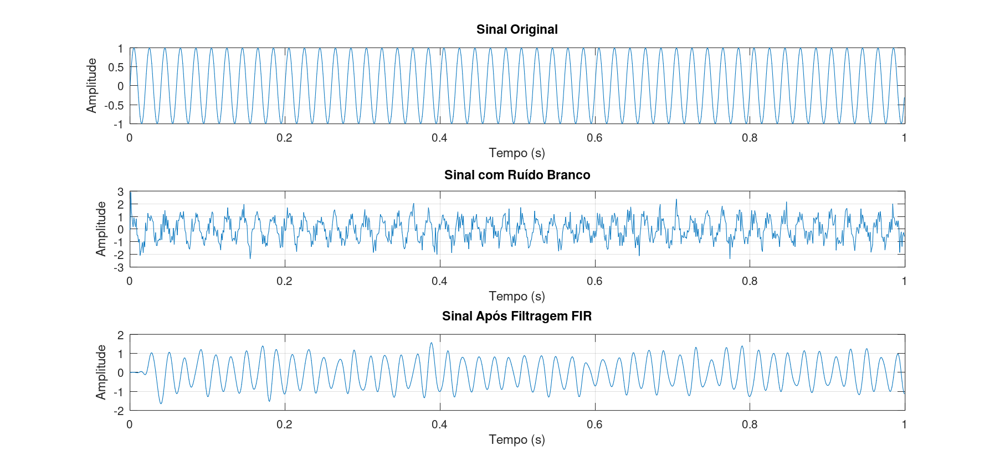

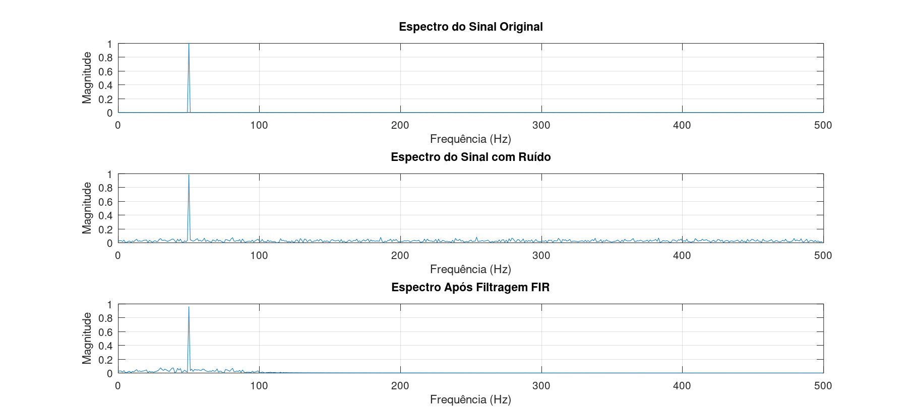

Nesta atividade foi gerado um sinal senoidal de 50 Hz contaminado por ruído branco aditivo.

O objetivo foi projetar um filtro FIR passa-baixa capaz de reduzir o ruído presente no sinal e preservar a informação útil.

## Geração do Sinal

O sinal original foi definido como uma senoide de 50 Hz.

Em seguida, foi adicionado ruído branco gaussiano ao sinal, simulando interferências aleatórias frequentemente encontradas em sistemas reais de aquisição e transmissão de dados.

O sinal observado passou a ser composto por:

- uma componente útil em 50 Hz;
- componentes de ruído distribuídas em uma ampla faixa de frequências.

## Projeto do Filtro

Foi utilizado um filtro FIR passa-baixa com:

- frequência de corte: 100 Hz;
- ordem: 80.

Como a frequência útil está abaixo da frequência de corte, espera-se que ela seja preservada.

As componentes de ruído localizadas em frequências mais elevadas devem ser significativamente atenuadas pelo filtro.

## Análise no Domínio do Tempo

O sinal contaminado apresenta oscilações irregulares causadas pelo ruído branco.

Essas flutuações dificultam a identificação da senoide original e reduzem a qualidade da informação disponível.

Após a filtragem, observa-se uma forma de onda mais suave e próxima da senoide de 50 Hz.

Grande parte das variações rápidas introduzidas pelo ruído foi removida, evidenciando a ação do filtro passa-baixa.

## Análise no Domínio da Frequência

O espectro do sinal ruidoso apresenta:

- um pico dominante em 50 Hz;
- componentes distribuídas por praticamente toda a faixa de frequências devido ao ruído branco.

Após a aplicação do filtro:

- o pico em 50 Hz permanece com amplitude significativa;
- as componentes de alta frequência são fortemente reduzidas;
- a energia do sinal concentra-se principalmente na região de baixas frequências.

Esses resultados demonstram a eficiência do filtro na remoção de parte do ruído presente no sinal.

## Avaliação da Redução de Ruído

O filtro FIR atua como um suavizador espectral.

Como o ruído branco possui energia distribuída em diversas frequências, a atenuação das componentes acima da frequência de corte reduz significativamente sua influência no sinal final.

Embora parte do ruído ainda permaneça dentro da banda passante, a qualidade do sinal é consideravelmente melhorada após a filtragem.

## Interpretação Física

Em sistemas reais, sensores, equipamentos eletrônicos e canais de comunicação frequentemente introduzem ruído aleatório durante a aquisição ou transmissão de sinais.

O filtro passa-baixa atua como um mecanismo de limpeza do sinal, preservando as componentes de interesse e reduzindo interferências de alta frequência.

Fisicamente, isso equivale a aumentar a relação sinal-ruído (SNR), tornando a informação mais confiável e mais fácil de analisar.

## Aplicações Práticas

A remoção de ruído por filtragem digital é amplamente utilizada em:

- sistemas de aquisição de dados;
- sensores industriais;
- processamento de áudio;
- equipamentos biomédicos;
- telecomunicações;
- sistemas embarcados;
- instrumentação eletrônica.

Nessas aplicações, a redução do ruído melhora a precisão das medições e a qualidade da informação processada.

## Conclusão

Os resultados demonstram que o filtro FIR passa-baixa foi capaz de reduzir significativamente o ruído branco aditivo presente no sinal.

A análise temporal mostrou uma forma de onda mais suave, enquanto a análise espectral evidenciou a atenuação das componentes de alta frequência associadas ao ruído.

Dessa forma, a filtragem digital mostrou-se uma ferramenta eficiente para melhorar a qualidade de sinais contaminados por interferências aleatórias.

# Questão 03

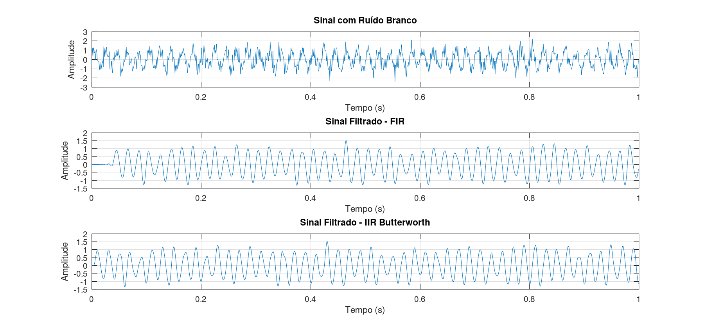

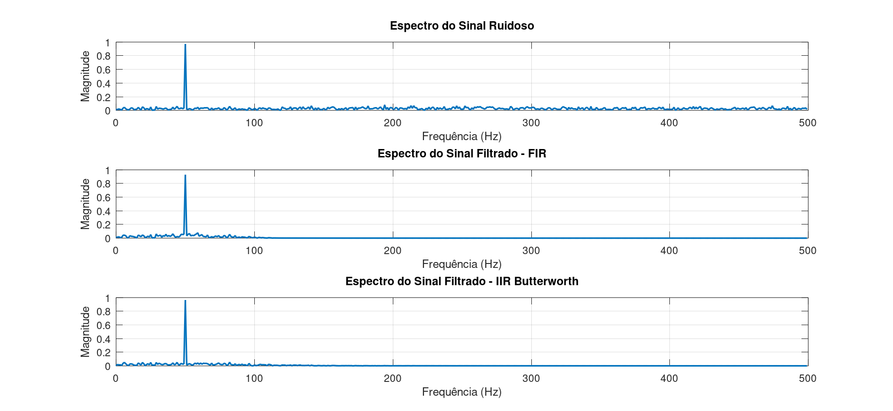

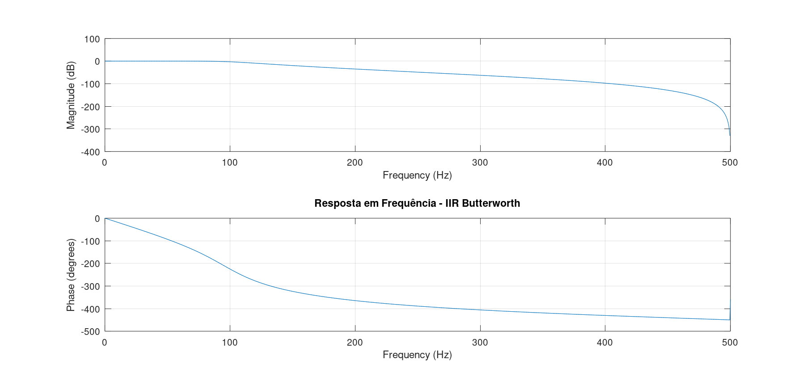

Nesta atividade foi repetido o experimento de remoção de ruído branco aditivo utilizando um filtro IIR Butterworth e os resultados foram comparados com aqueles obtidos anteriormente com um filtro FIR passa-baixa.

O sinal analisado foi composto por uma senoide de 50 Hz contaminada por ruído branco gaussiano.

## Projeto dos Filtros

Foram utilizados dois filtros passa-baixa com frequência de corte de 100 Hz:

- filtro FIR de ordem 80;
- filtro IIR Butterworth de ordem 5.

Ambos possuem o mesmo objetivo: preservar a componente útil de 50 Hz e reduzir as componentes de ruído distribuídas ao longo do espectro.

## Análise no Domínio do Tempo

O sinal contaminado apresenta oscilações rápidas e aleatórias causadas pelo ruído branco.

Após a aplicação dos filtros, observa-se uma redução significativa dessas oscilações.

O filtro FIR produz uma forma de onda bastante suave e com boa preservação do formato original do sinal.

O filtro IIR Butterworth também reduz o ruído de maneira eficiente, produzindo um sinal visualmente semelhante ao obtido com o filtro FIR.

Entretanto, devido à característica de fase não linear do filtro IIR, podem ocorrer pequenas distorções temporais que não estão presentes no filtro FIR.

## Análise no Domínio da Frequência

O espectro do sinal ruidoso apresenta:

- um pico em 50 Hz correspondente ao sinal útil;
- componentes distribuídas em praticamente toda a faixa de frequências devido ao ruído branco.

Após a filtragem com ambos os filtros:

- o pico em 50 Hz permanece preservado;
- as componentes acima da frequência de corte são fortemente atenuadas;
- a energia do sinal concentra-se nas baixas frequências.

Os dois filtros conseguem reduzir o ruído de forma eficiente, embora utilizem estruturas bastante diferentes.

## Comparação entre FIR e IIR

A principal diferença observada está relacionada à forma de implementação dos filtros.

O filtro FIR:

- utiliza maior quantidade de coeficientes;
- possui fase aproximadamente linear;
- preserva melhor a forma temporal do sinal;
- apresenta maior custo computacional.

O filtro IIR Butterworth:

- utiliza uma ordem muito menor;
- apresenta menor custo computacional;
- fornece boa seletividade;
- possui fase não linear.

Isso significa que o filtro IIR consegue atingir desempenho semelhante na atenuação do ruído utilizando menos operações matemáticas.

## Interpretação Física

Em aplicações práticas, a escolha entre FIR e IIR depende dos requisitos do sistema.

Quando a preservação da forma temporal do sinal é fundamental, como em processamento de áudio, sinais biomédicos ou sistemas de medição, filtros FIR costumam ser preferidos devido à sua fase linear.

Quando a prioridade é reduzir a complexidade computacional e o consumo de recursos, filtros IIR são frequentemente utilizados por conseguirem respostas semelhantes com ordens muito menores.

## Aplicações Práticas

A comparação entre filtros FIR e IIR é relevante em:

- sistemas embarcados;
- telecomunicações;
- processamento de áudio;
- instrumentação eletrônica;
- sensores industriais;
- equipamentos biomédicos.

Nessas aplicações, a escolha adequada do filtro influencia diretamente a qualidade do sinal processado e o desempenho do sistema.

## Conclusão

Os resultados demonstram que tanto o filtro FIR quanto o filtro IIR Butterworth foram capazes de reduzir significativamente o ruído branco presente no sinal.

O filtro FIR apresentou melhor preservação da forma temporal devido à sua característica de fase linear, enquanto o filtro IIR alcançou desempenho semelhante utilizando uma ordem muito menor e menor custo computacional.

Assim, a escolha entre FIR e IIR depende do compromisso desejado entre fidelidade temporal e eficiência computacional.

# Questão 04

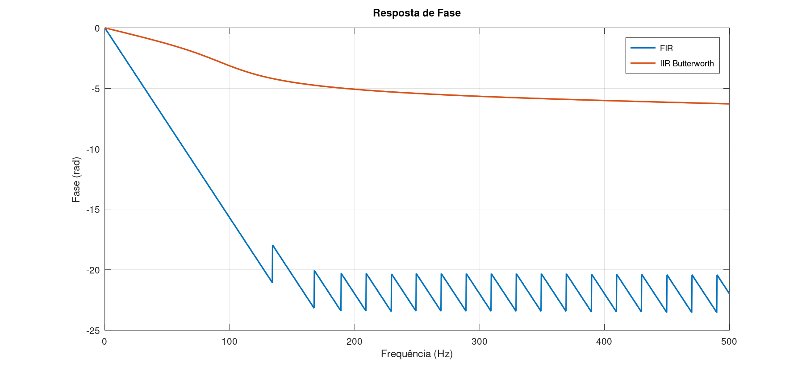

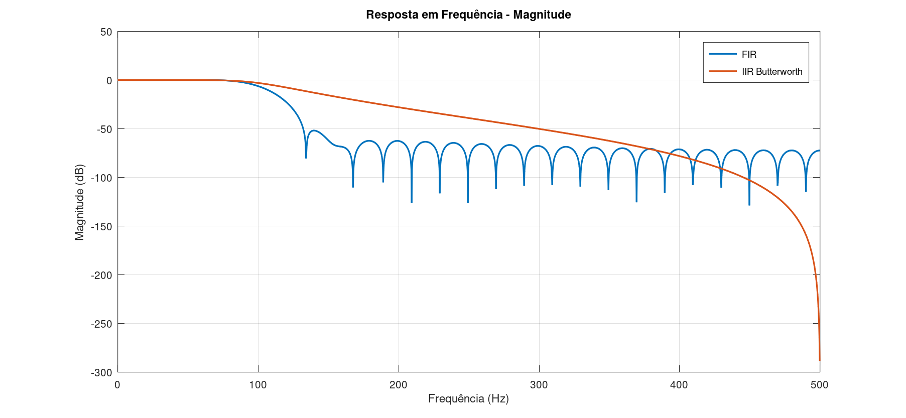

Foram projetados dois filtros passa-baixa com frequência de corte de 100 Hz:

- Filtro FIR de ordem 50;
- Filtro IIR Butterworth de ordem 4.

A comparação foi realizada por meio das respostas em frequência (magnitude) e das respostas de fase.

## Análise da Magnitude

Observando o gráfico da resposta em frequência, nota-se que ambos os filtros permitem a passagem das componentes abaixo de 100 Hz e atenuam componentes acima dessa frequência.

Entretanto, existem diferenças importantes:

### Filtro FIR

- Apresenta uma transição mais gradual entre a banda de passagem e a banda de rejeição.
- Necessita de uma ordem maior para obter elevada seletividade.
- Possui pequenas ondulações devido à técnica de projeto por janelas.

### Filtro IIR Butterworth

- Apresenta uma transição mais rápida para a banda de rejeição.
- Obtém boa seletividade utilizando uma ordem muito menor.
- Possui resposta monotônica, sem ondulações significativas.

Isso demonstra que filtros IIR conseguem atingir especificações semelhantes utilizando menos coeficientes e menor custo computacional.

## Análise da Fase

A principal diferença aparece na resposta de fase.

### Filtro FIR

A resposta de fase é aproximadamente linear.

Isso significa que todas as componentes de frequência sofrem atrasos semelhantes, preservando a forma temporal do sinal.

Consequências:

- menor distorção temporal;
- preservação da forma de onda;
- adequado para áudio, imagens e sinais biomédicos.

### Filtro IIR Butterworth

A resposta de fase é não linear.

Dessa forma, diferentes frequências sofrem atrasos distintos.

Consequências:

- possível deformação da forma do sinal;
- maior distorção temporal;
- menor fidelidade temporal.

Apesar disso, em muitas aplicações práticas essa distorção é aceitável.

## Comparação Geral

| Característica | FIR | IIR Butterworth |
|---------------|-----|-----|
| Frequência de corte | 100 Hz | 100 Hz |
| Ordem utilizada | 50 | 4 |
| Fase linear | Sim | Não |
| Seletividade | Menor | Maior |
| Custo computacional | Maior | Menor |
| Estabilidade | Sempre estável | Depende dos polos |

## Conclusão

Os resultados mostram que o filtro IIR Butterworth apresenta maior eficiência computacional e melhor seletividade espectral para uma mesma frequência de corte.

Por outro lado, o filtro FIR oferece a vantagem da fase linear, preservando a forma temporal dos sinais.

Assim, a escolha entre FIR e IIR depende da aplicação:

- quando a preservação da forma do sinal é essencial, o FIR é geralmente preferido;
- quando o objetivo é reduzir custo computacional mantendo boa filtragem, o IIR torna-se mais vantajoso.

# Questão 05

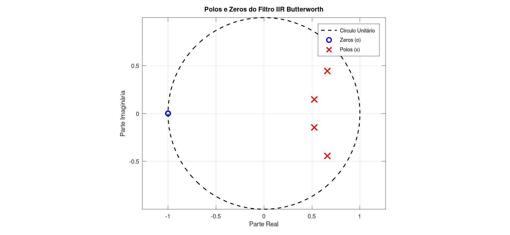

Nesta atividade foi projetado um filtro IIR Butterworth passa-baixa de quarta ordem e realizada a análise de seus polos e zeros no plano Z.

A representação gráfica dos polos e zeros permite compreender diversas características do filtro, especialmente sua estabilidade e seletividade.

## Polos e Zeros

Os zeros correspondem às frequências que tendem a ser atenuadas pelo sistema.

Os polos, por sua vez, exercem forte influência sobre:

- resposta em frequência;
- seletividade do filtro;
- comportamento transitório;
- estabilidade.

A localização desses elementos no plano Z determina o comportamento global do sistema.

## Critério de Estabilidade

Para filtros digitais IIR, a estabilidade BIBO (Bounded Input, Bounded Output) depende exclusivamente da posição dos polos.

O critério é:

- Todos os polos devem estar dentro do círculo unitário.

Matematicamente:

```
|polo| < 1
```

onde:

- `|polo|` representa a distância do polo à origem do plano Z.

Se qualquer polo estiver:

- sobre o círculo unitário (`|polo| = 1`) → sistema marginalmente estável;
- fora do círculo unitário (`|polo| > 1`) → sistema instável.

## Análise do Filtro Projetado

Observando o gráfico do plano Z, verifica-se que:

- todos os polos encontram-se dentro do círculo unitário;
- os zeros localizam-se próximos da região correspondente às frequências rejeitadas pelo filtro;
- os polos concentram-se próximos ao círculo unitário, característica típica de filtros Butterworth.

Como todos os polos apresentam módulo inferior a 1, o filtro é estável.

## Relação entre Polos e Resposta do Filtro

A proximidade dos polos ao círculo unitário influencia diretamente a seletividade.

### Polos mais próximos do círculo unitário

- maior seletividade;
- transição mais abrupta;
- resposta ao impulso mais longa.

### Polos mais afastados do círculo unitário

- menor seletividade;
- transição mais suave;
- resposta ao impulso mais curta.

Isso explica por que filtros IIR conseguem obter elevada seletividade utilizando poucas operações matemáticas.

## Comparação com Filtros FIR

Nos filtros FIR não existem polos associados à realimentação.

Por esse motivo:

- filtros FIR são sempre estáveis;
- não é necessário verificar a posição dos polos;
- a análise de estabilidade é mais simples.

Já nos filtros IIR, a estabilidade depende diretamente da posição dos polos, tornando essa análise uma etapa essencial do projeto.

## Conclusão

A representação dos polos e zeros mostrou que o filtro Butterworth projetado é estável, pois todos os polos encontram-se dentro do círculo unitário.

Além disso, foi possível observar que a localização dos polos influencia diretamente a seletividade e o comportamento dinâmico do filtro.

A análise de polos e zeros constitui uma ferramenta fundamental no projeto de filtros IIR, permitindo prever estabilidade, desempenho espectral e resposta temporal antes mesmo da aplicação do filtro a sinais reais.

# Questão 06

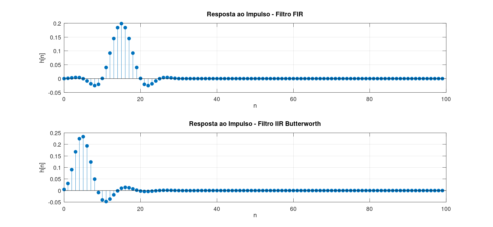

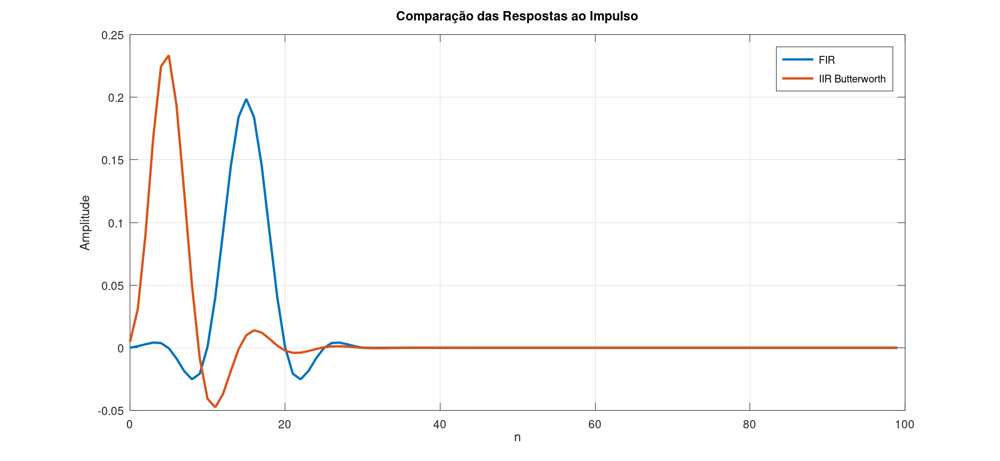

Nesta atividade foi analisada a resposta ao impulso de um filtro FIR e de um filtro IIR Butterworth. Para isso, aplicou-se como entrada um impulso discreto unitário:

```
δ[n] = 1, para n = 0
δ[n] = 0, para n ≠ 0
```

A resposta obtida permite observar diretamente o comportamento interno de cada filtro.

## Resposta ao Impulso do Filtro FIR

Observa-se que a resposta do filtro FIR possui duração limitada.

Após um determinado número de amostras, a resposta torna-se exatamente nula.

Isso ocorre porque a saída do filtro FIR depende apenas da entrada atual e de um número finito de entradas passadas:


$y[n] = b_0x[n] + b_1x[n−1] + ... + b_Mx[n−M]$

Quando o impulso percorre todos os coeficientes do filtro, não existe nenhum mecanismo que continue alimentando o sistema.

Consequentemente:

- a resposta termina após um número finito de amostras;
- o filtro possui memória finita;
- a estabilidade é garantida.

Por esse motivo, filtros FIR recebem o nome de **Finite Impulse Response** (Resposta Finita ao Impulso).

## Resposta ao Impulso do Filtro IIR

No filtro IIR observa-se um comportamento diferente.

Após o impulso inicial, a resposta continua existindo durante muitas amostras, decaindo gradualmente.

Isso acontece porque a saída depende também de saídas anteriores:

$ y[n] = Σ b_kx[n−k] − Σ a_ky[n−k] $

A presença dos termos de realimentação faz com que parte da energia armazenada seja continuamente reutilizada pelo sistema.

Mesmo quando a entrada já é zero, os valores anteriores da saída continuam influenciando novas saídas.

Consequentemente:

- a resposta não termina abruptamente;
- ocorre um decaimento gradual;
- a resposta é teoricamente infinita.

Por isso esses filtros são chamados de **Infinite Impulse Response** (Resposta Infinita ao Impulso).

## Comparação entre FIR e IIR

| Característica | FIR | IIR |
|---------------|-----|-----|
| Resposta ao impulso | Finita | Infinita |
| Realimentação | Não possui | Possui |
| Memória | Finita | Potencialmente infinita |
| Estabilidade | Sempre estável | Depende dos polos |
| Complexidade | Maior | Menor |
| Seletividade por ordem | Menor | Maior |

## Interpretação Física

Uma forma intuitiva de entender a diferença é pensar em dois sistemas mecânicos.

### Sistema semelhante ao FIR

Imagine empurrar um objeto sobre uma superfície com atrito.

Após algum tempo ele para completamente.

O efeito da excitação desaparece após um período finito.

### Sistema semelhante ao IIR

Imagine uma mola com amortecimento muito pequeno.

Após receber um impulso, ela continua oscilando durante bastante tempo antes de parar.

Mesmo sem novas excitações, o sistema continua respondendo devido à energia armazenada internamente.

Esse comportamento é análogo à realimentação presente nos filtros IIR.

## Conclusão

A análise da resposta ao impulso mostrou claramente a principal diferença estrutural entre filtros FIR e IIR.

O filtro FIR apresenta resposta finita porque depende apenas das amostras de entrada, sem utilizar realimentação. Já o filtro IIR apresenta resposta teoricamente infinita devido à presença de saídas passadas em sua equação de diferença.

Essa característica permite que filtros IIR obtenham maior seletividade utilizando menos coeficientes, enquanto filtros FIR oferecem maior simplicidade e estabilidade, além da possibilidade de fase linear.

# Questão 07

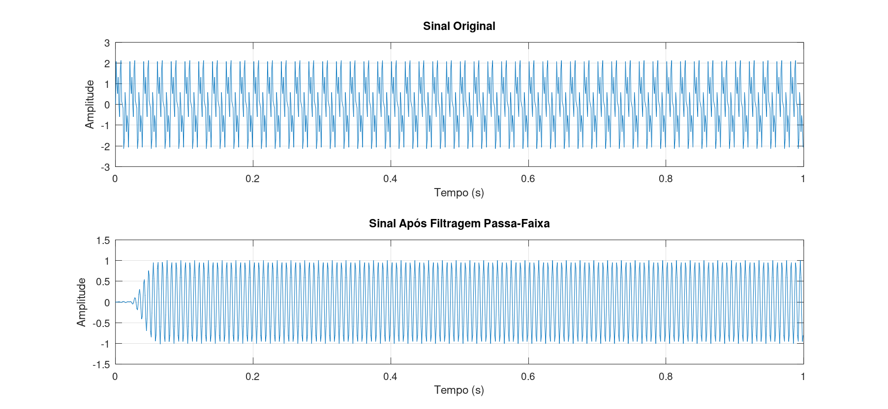

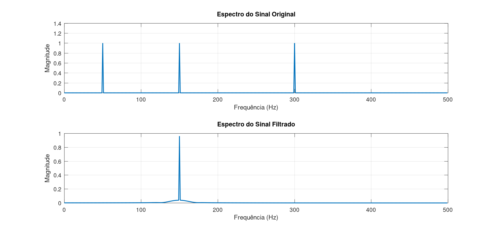

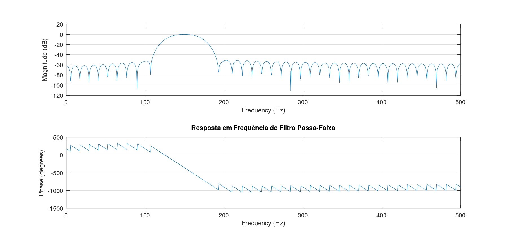

Nesta atividade foi gerado um sinal composto por três componentes senoidais:

- 50 Hz;
- 150 Hz;
- 300 Hz.

O objetivo foi projetar um filtro passa-faixa capaz de selecionar apenas a componente de 150 Hz, rejeitando as demais frequências presentes no sinal.

## Projeto do Filtro

Foi utilizado um filtro FIR passa-faixa com:

- frequência inferior de corte: 130 Hz;
- frequência superior de corte: 170 Hz;
- ordem: 80.

Essa faixa foi escolhida para permitir a passagem da senoide de 150 Hz enquanto atenua as componentes de 50 Hz e 300 Hz.

## Análise no Domínio do Tempo

Antes da filtragem, o sinal apresenta uma forma de onda complexa resultante da soma das três senoides.

Após a aplicação do filtro passa-faixa, observa-se uma forma de onda muito mais próxima de uma senoide pura, indicando que as componentes indesejadas foram significativamente reduzidas.

## Análise no Domínio da Frequência

A FFT do sinal original apresenta três picos claramente identificáveis:

- pico em 50 Hz;
- pico em 150 Hz;
- pico em 300 Hz.

Após a filtragem:

- o pico em 150 Hz permanece praticamente inalterado;
- os picos em 50 Hz e 300 Hz são fortemente atenuados;
- a energia do sinal concentra-se na faixa selecionada pelo filtro.

Isso confirma que o filtro foi capaz de isolar a frequência desejada.

## Interpretação Física

O filtro passa-faixa atua como um seletor espectral.

Seu funcionamento é semelhante ao de um receptor de rádio que escolhe apenas uma estação específica entre diversas frequências transmitidas simultaneamente.

Nesse experimento:

- a frequência de 150 Hz representa a informação de interesse;
- as frequências de 50 Hz e 300 Hz representam interferências ou sinais indesejados.

O filtro permite extrair apenas a informação relevante.

## Aplicações Práticas

Filtros passa-faixa são amplamente utilizados em:

- telecomunicações digitais;
- receptores de rádio e TV;
- processamento de áudio;
- análise de vibrações mecânicas;
- monitoramento industrial;
- instrumentação eletrônica.

Por exemplo, em um sistema de monitoramento de máquinas, um filtro passa-faixa pode isolar a frequência característica de uma falha mecânica específica, facilitando sua detecção.

## Conclusão

Os resultados demonstram que o filtro passa-faixa foi capaz de selecionar com sucesso a componente de 150 Hz presente no sinal composto.

A análise espectral mostrou que as frequências fora da banda de passagem foram significativamente atenuadas, comprovando a eficiência da filtragem e evidenciando a utilidade dos filtros passa-faixa em aplicações de seleção e extração de informações espectrais.

# Questão 08

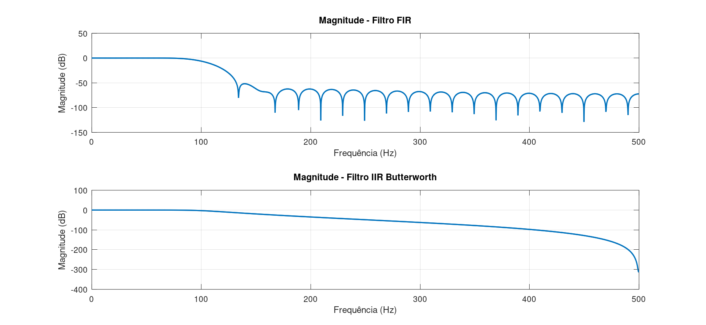

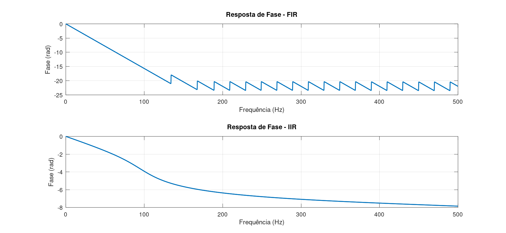

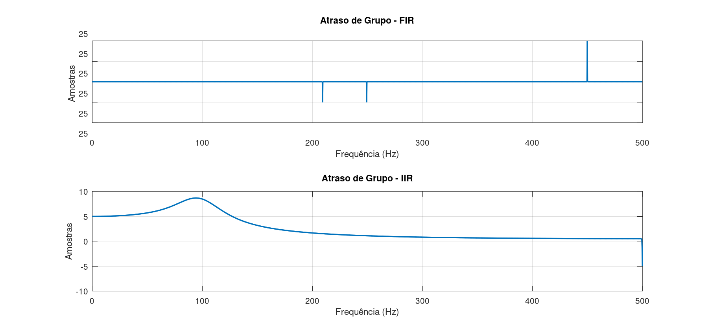

Nesta atividade foram projetados dois filtros passa-baixa com frequência de corte de 100 Hz:

- um filtro FIR de ordem 50;
- um filtro IIR Butterworth de ordem 5.

O objetivo foi comparar suas respostas de fase e compreender o conceito de fase linear.

## Projeto dos Filtros

O filtro FIR foi obtido utilizando o método das janelas através da função `fir1`.

O filtro IIR foi implementado utilizando a aproximação de Butterworth por meio da função `butter`.

Embora ambos possuam a mesma frequência de corte, apresentam comportamentos distintos em relação à fase.

## Análise da Resposta de Fase

A resposta de fase do filtro FIR apresenta um comportamento praticamente linear na faixa de passagem.

Isso significa que a fase varia aproximadamente de forma proporcional à frequência.

Já o filtro IIR apresenta uma resposta de fase não linear, com variações mais acentuadas próximas à frequência de corte.

Como consequência, diferentes componentes espectrais sofrem atrasos diferentes ao atravessar o filtro.

## Conceito de Fase Linear

Um filtro possui fase linear quando sua resposta de fase pode ser representada por uma reta da forma:

$ \phi(\omega) = -\omega\tau $

onde:

- $ \phi(\omega) $  é a fase;
- $ \omega $ é a frequência angular;
- $ \tau $ é um atraso constante.

Nessa situação, todas as componentes de frequência do sinal sofrem exatamente o mesmo atraso temporal.

O resultado é a preservação da forma original do sinal após a filtragem.

## Análise do Atraso de Grupo

O atraso de grupo representa o atraso introduzido pelo filtro em cada componente espectral.

Para o filtro FIR observa-se:

- atraso praticamente constante;
- comportamento característico de fase linear;
- baixa distorção da forma de onda.

Para o filtro IIR observa-se:

- atraso variável com a frequência;
- fase não linear;
- possibilidade de distorção temporal do sinal.

Essas diferenças ficam evidentes nos gráficos de atraso de grupo, onde o filtro FIR apresenta uma curva praticamente constante enquanto o filtro IIR exibe variações ao longo da frequência.

## Comparação entre FIR e IIR

A análise conjunta dos resultados mostra que o filtro FIR apresenta melhor desempenho quando a preservação da forma temporal do sinal é importante, devido à sua característica de fase linear.

Por outro lado, o filtro IIR consegue obter uma resposta de magnitude semelhante utilizando uma ordem muito menor, reduzindo o custo computacional e a quantidade de coeficientes necessários.

Assim, existe um compromisso entre desempenho de fase e eficiência computacional.

## Interpretação Física

Considere um sinal composto por várias frequências simultâneas.

Em um filtro FIR de fase linear, todas essas frequências sofrem o mesmo atraso, preservando o formato original do sinal após a filtragem.

Em um filtro IIR, cada componente espectral pode sofrer um atraso diferente. Como resultado, ocorre um desalinhamento temporal entre as frequências, modificando a forma de onda original.

Esse fenômeno é especialmente relevante em aplicações de:

- áudio digital;
- processamento de voz;
- telecomunicações;
- sistemas de instrumentação;
- processamento biomédico.

## Conclusão

Os resultados demonstram que o filtro FIR apresenta resposta de fase aproximadamente linear e atraso de grupo praticamente constante, preservando a forma temporal do sinal filtrado.

Já o filtro IIR apresenta fase não linear e atraso de grupo variável, podendo introduzir distorções temporais mesmo quando a resposta em magnitude é adequada.

Portanto, filtros FIR são preferidos quando a fidelidade temporal é um requisito importante, enquanto filtros IIR são frequentemente utilizados quando se busca menor complexidade computacional e menor ordem de implementação.

# Questão 09

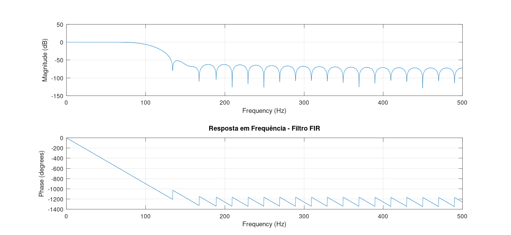

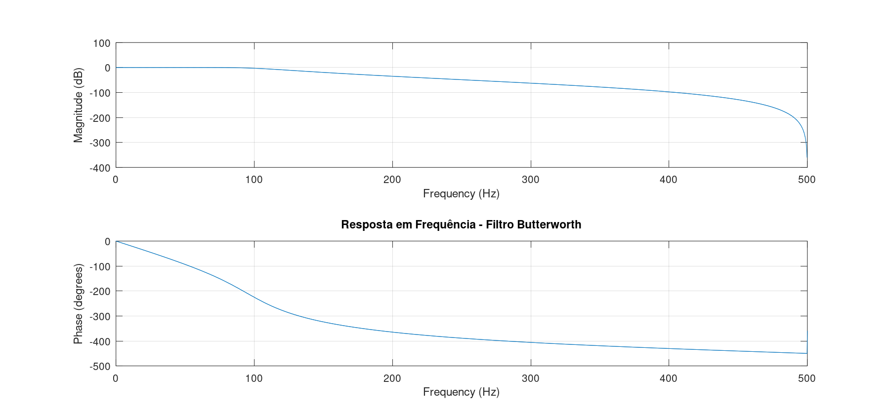

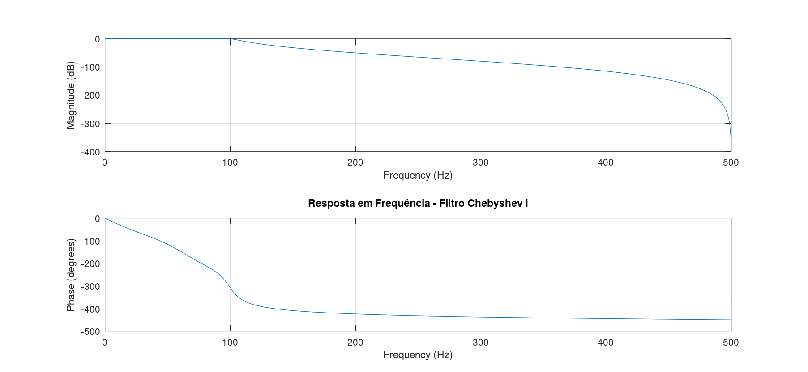

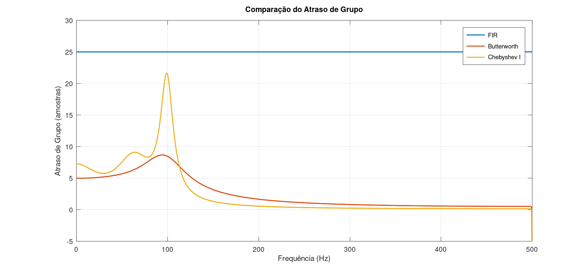

Nesta atividade foram analisados os atrasos de grupo de três filtros digitais distintos:

- filtro FIR passa-baixa de ordem 50;
- filtro IIR Butterworth de ordem 5;
- filtro IIR Chebyshev Tipo I de ordem 5.

O objetivo foi comparar o comportamento temporal desses filtros e compreender a importância do atraso de grupo em sistemas de comunicação.

## Conceito de Atraso de Grupo

O atraso de grupo representa o atraso sofrido pelas diferentes componentes espectrais de um sinal ao atravessarem um sistema.

Matematicamente, ele corresponde à taxa de variação da fase em relação à frequência.

Esse parâmetro permite avaliar como cada frequência é atrasada durante o processo de filtragem.

Quando o atraso de grupo é constante, todas as componentes do sinal sofrem o mesmo atraso temporal, preservando sua forma original.

## Análise dos Resultados

O gráfico de comparação mostra diferenças significativas entre os filtros analisados.

### Filtro FIR

O filtro FIR apresenta atraso de grupo praticamente constante ao longo da banda de passagem.

Esse comportamento é característico de filtros de fase linear.

Como todas as frequências sofrem o mesmo atraso, a forma temporal do sinal é preservada após a filtragem.

### Filtro Butterworth

O filtro Butterworth apresenta atraso de grupo variável com a frequência.

Embora as variações sejam relativamente suaves, diferentes componentes espectrais sofrem atrasos distintos.

Isso pode introduzir pequenas distorções temporais no sinal filtrado.

### Filtro Chebyshev Tipo I

O filtro Chebyshev apresenta maior variação do atraso de grupo em comparação ao Butterworth.

As oscilações observadas são consequência das características de sua resposta em frequência, que prioriza uma transição mais rápida entre banda passante e banda de rejeição.

Como resultado, podem ocorrer distorções temporais mais pronunciadas.

## Comparação entre os Filtros

A análise dos resultados permite observar que:

- o filtro FIR possui o atraso de grupo mais uniforme;
- o filtro Butterworth apresenta comportamento intermediário;
- o filtro Chebyshev apresenta as maiores variações de atraso de grupo.

Embora filtros IIR geralmente necessitem de ordens menores para atingir determinada seletividade, eles tendem a apresentar maior não linearidade de fase e maior variação do atraso de grupo.

## Importância em Sistemas de Comunicação

O atraso de grupo é um parâmetro fundamental em sistemas de comunicação digital.

Quando diferentes componentes de frequência sofrem atrasos distintos, ocorre dispersão temporal do sinal transmitido.

Esse fenômeno pode causar:

- distorção de pulsos digitais;
- aumento da interferência entre símbolos (ISI);
- degradação da qualidade do sinal recebido;
- aumento da taxa de erros de transmissão.

Em sistemas de alta velocidade, pequenas variações no atraso de grupo podem comprometer significativamente a integridade da informação transmitida.

Por esse motivo, filtros com atraso de grupo aproximadamente constante são frequentemente utilizados em aplicações que exigem elevada fidelidade temporal.

## Aplicações Práticas

A análise do atraso de grupo é importante em:

- sistemas de comunicação digital;
- transmissão de dados em alta velocidade;
- redes ópticas;
- processamento de áudio;
- transmissão de vídeo;
- sistemas de radar;
- instrumentação eletrônica.

Nessas aplicações, preservar o alinhamento temporal das componentes espectrais é essencial para garantir a qualidade da informação processada.

## Conclusão

Os resultados demonstram que diferentes filtros digitais apresentam comportamentos distintos em relação ao atraso de grupo.

O filtro FIR apresentou atraso praticamente constante, preservando a forma temporal do sinal e caracterizando uma resposta de fase linear.

Os filtros Butterworth e Chebyshev apresentaram atrasos de grupo variáveis, sendo o Chebyshev o que exibiu as maiores variações.

Dessa forma, o atraso de grupo constitui um parâmetro fundamental na avaliação de filtros digitais, especialmente em sistemas de comunicação, onde a preservação temporal dos sinais é essencial para garantir a correta transmissão da informação.

# Questão 10

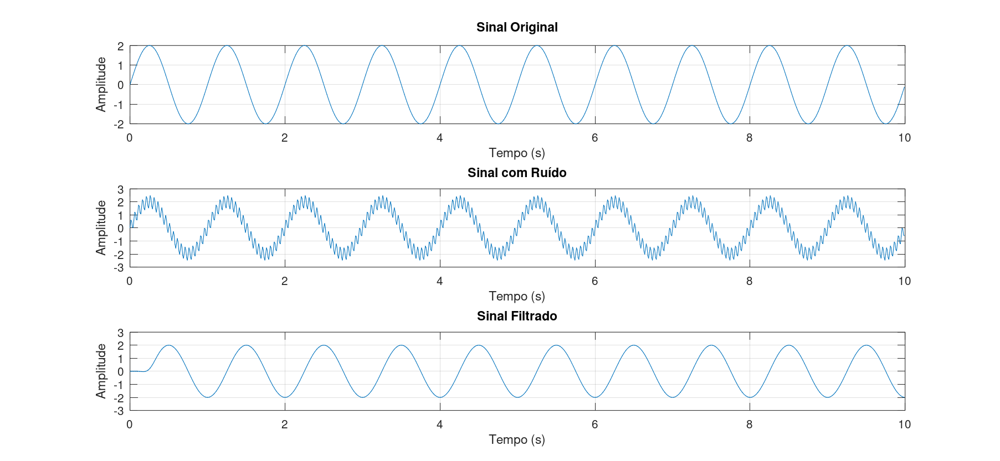

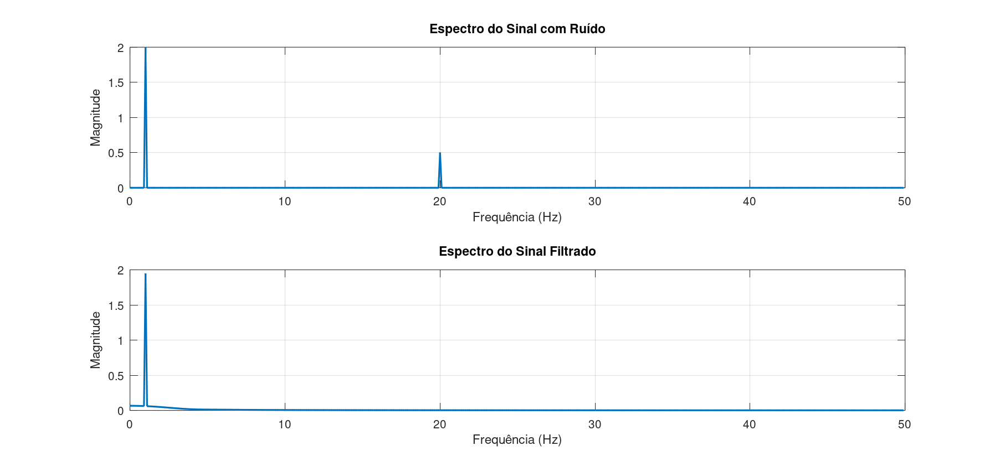

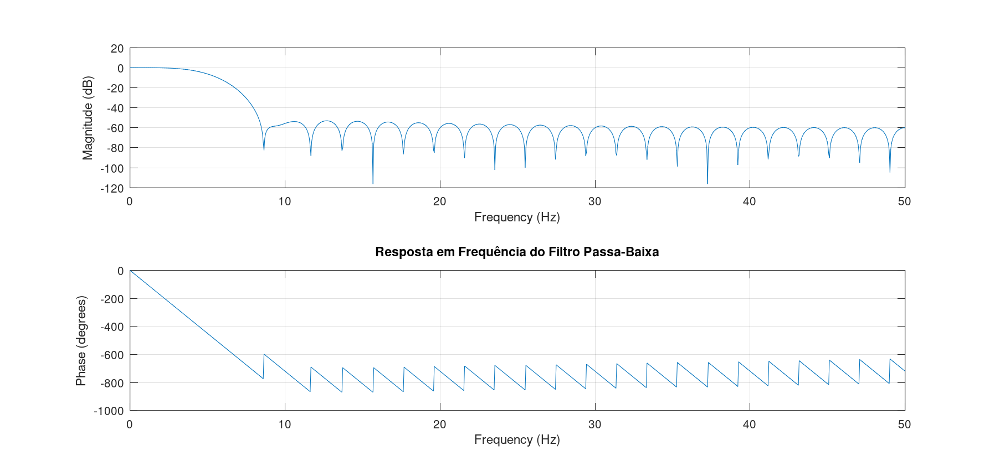

Nesta atividade foi implementada uma aplicação prática de filtragem digital voltada para a remoção de ruído em sinais de sensores.

O cenário simula um sensor que mede uma variável física de variação lenta, como temperatura, pressão ou nível de líquido. Durante a aquisição dos dados, o sinal é contaminado por ruídos de alta frequência provenientes de interferências elétricas, vibrações ou perturbações do ambiente.

## Descrição do Sinal

O sinal útil foi modelado por uma senoide de 1 Hz, representando uma grandeza física que varia lentamente ao longo do tempo.

Além disso, foi adicionado um ruído senoidal de 20 Hz para simular interferências presentes na medição.

Assim, o sinal observado pelo sensor é composto por:

- componente útil em 1 Hz;
- componente de ruído em 20 Hz.

## Projeto do Filtro

Para remover o ruído foi utilizado um filtro FIR passa-baixa com:

- frequência de corte de 5 Hz;
- ordem 50.

Como a frequência útil está abaixo de 5 Hz e o ruído está em 20 Hz, espera-se que o filtro preserve a informação desejada e atenue significativamente a interferência.

## Análise no Domínio do Tempo

Antes da filtragem, o sinal apresenta oscilações rápidas provocadas pelo ruído de alta frequência.

Essas oscilações dificultam a visualização da tendência real da variável medida e podem comprometer análises posteriores.

Após a aplicação do filtro passa-baixa, observa-se uma forma de onda mais suave, acompanhando adequadamente a variação lenta do sinal original.

O ruído de alta frequência é significativamente reduzido, tornando a medição mais estável e confiável.

## Análise no Domínio da Frequência

O espectro do sinal contaminado apresenta dois picos principais:

- pico em 1 Hz correspondente ao sinal útil;
- pico em 20 Hz correspondente ao ruído.

Após a filtragem:

- o pico em 1 Hz permanece praticamente inalterado;
- o pico em 20 Hz é fortemente atenuado;
- a energia do sinal concentra-se na região de baixas frequências.

Esses resultados confirmam a eficiência do filtro na remoção da componente indesejada.

## Interpretação Física

Em sistemas reais de aquisição de dados, sensores frequentemente captam sinais de interesse juntamente com interferências externas.

A filtragem digital atua como um mecanismo de seleção espectral, permitindo separar a informação útil das componentes indesejadas.

Neste experimento:

- a componente de 1 Hz representa a variável física monitorada;
- a componente de 20 Hz representa ruídos e interferências do ambiente.

O filtro passa-baixa reduz a influência dessas interferências sem alterar significativamente a informação desejada.

Fisicamente, isso equivale a tornar a medição mais estável, reduzindo oscilações artificiais e aumentando a confiabilidade dos dados obtidos pelo sistema.

## Aplicações Práticas

A filtragem digital de sinais de sensores é amplamente utilizada em:

- sistemas de automação industrial;
- monitoramento de temperatura;
- sensores de pressão;
- sensores de nível;
- sistemas embarcados;
- instrumentação eletrônica;
- aquisição de sinais biomédicos.

Em todos esses casos, a remoção de ruídos contribui para melhorar a precisão das medições e a qualidade das decisões tomadas a partir dos dados coletados.

## Conclusão

Os resultados demonstram que a filtragem digital é uma ferramenta eficiente para remoção de ruídos em sinais de sensores.

O filtro passa-baixa preservou a componente útil de baixa frequência e reduziu significativamente a interferência de alta frequência presente no sinal.

A análise temporal e espectral confirmou a eficácia do processo de filtragem, evidenciando a importância dos filtros digitais em aplicações práticas de instrumentação, automação e processamento de sinais.

# Problema Norteador

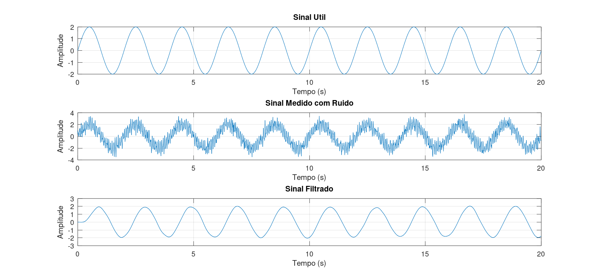

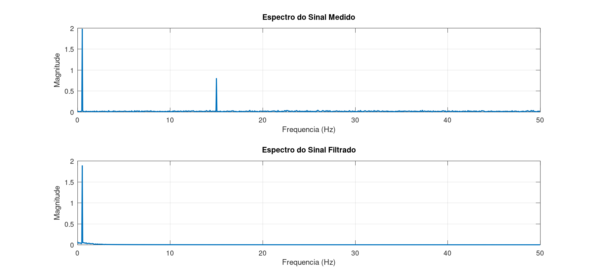

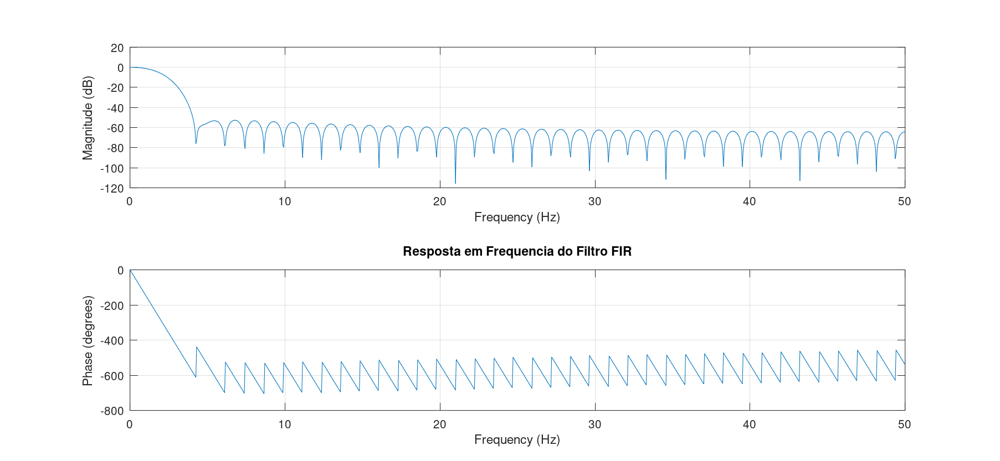

Neste estudo foi analisado um sistema de monitoramento agrícola que utiliza sensores para medir variáveis ambientais, como temperatura, umidade do solo, pressão ou nível de água.

Em aplicações reais, os sinais adquiridos pelos sensores frequentemente são contaminados por ruídos provenientes de:

- interferências eletromagnéticas;
- circuitos eletrônicos de aquisição;
- motores e equipamentos agrícolas;
- variações aleatórias do ambiente.

O objetivo foi projetar e validar um filtro digital capaz de reduzir essas interferências sem comprometer as informações relevantes para a tomada de decisão.

## Modelagem do Problema

O sinal útil foi representado por uma senoide de baixa frequência (0,5 Hz), simulando uma variável agrícola que varia lentamente ao longo do tempo.

Ao sinal útil foram adicionados:

- ruído branco aleatório;
- uma interferência senoidal de 15 Hz.

O sinal obtido representa uma situação típica encontrada em sistemas de monitoramento de campo.

## Projeto do Filtro

Foi utilizado um filtro FIR passa-baixa com:

- frequência de corte de 2 Hz;
- ordem 80.

A escolha da frequência de corte foi baseada no fato de que as variáveis agrícolas normalmente apresentam variações lentas, concentrando sua energia em baixas frequências.

Dessa forma, o filtro permite preservar a informação útil enquanto atenua componentes de frequência mais elevada associadas ao ruído.

## Validação no Domínio do Tempo

O sinal medido apresenta oscilações rápidas causadas pelas interferências adicionadas.

Após a filtragem observa-se:

- redução significativa das oscilações indesejadas;
- suavização do sinal;
- preservação da tendência principal da variável monitorada.

Esses resultados indicam que o filtro conseguiu recuperar adequadamente a informação de interesse.

## Validação no Domínio da Frequência

A análise espectral mostra que o sinal original contém:

- uma componente em 0,5 Hz correspondente ao sinal útil;
- uma componente em 15 Hz correspondente à interferência;
- energia distribuída em várias frequências devido ao ruído branco.

Após a filtragem:

- a componente de 0,5 Hz permanece preservada;
- a componente de 15 Hz é fortemente atenuada;
- ocorre redução significativa da energia associada ao ruído.

Isso confirma a eficiência do filtro na separação entre informação útil e interferências.

## Critérios de Validação

A validação do filtro pode ser realizada observando:

- preservação da amplitude do sinal útil;
- redução das componentes de ruído no espectro;
- manutenção da tendência temporal dos dados;
- ausência de distorções significativas na informação medida.

Quando esses critérios são atendidos, o filtro pode ser considerado adequado para utilização no sistema de monitoramento.

## Interpretação Física

Em um ambiente agrícola, decisões relacionadas à irrigação, fertilização e controle climático dependem diretamente da qualidade dos dados fornecidos pelos sensores.

A presença de ruídos pode provocar leituras incorretas e levar a decisões inadequadas.

O filtro digital atua como uma etapa de pré-processamento dos dados, removendo interferências e fornecendo medições mais estáveis e confiáveis.

Fisicamente, isso significa que as informações utilizadas pelo sistema refletem melhor o comportamento real da variável monitorada.

## Aplicações Práticas

A filtragem digital pode ser aplicada em sensores de:

- umidade do solo;
- temperatura ambiente;
- velocidade do vento;
- vazão de sistemas de irrigação;
- nível de reservatórios;
- monitoramento de estufas agrícolas.

Em todos esses casos, a redução de ruídos melhora a qualidade dos dados e aumenta a confiabilidade das decisões automatizadas.

## Conclusão

Para reduzir os ruídos presentes nos sinais de sensores agrícolas sem comprometer as informações relevantes, pode-se projetar um filtro digital passa-baixa adequado à faixa de frequências da variável monitorada.

A validação deve ser realizada por meio da análise temporal e espectral dos sinais, verificando a preservação das componentes úteis e a atenuação das interferências.

Os resultados obtidos demonstram que o filtro FIR projetado foi capaz de melhorar significativamente a qualidade das medições, tornando os dados mais adequados para sistemas de monitoramento e tomada de decisão no contexto agrícola.